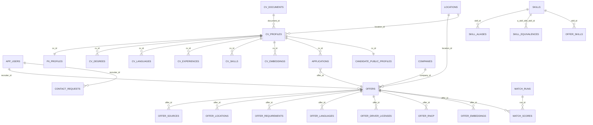

# Architecture BDD — Guide & Schéma

> **Portée** : Ce document résume l’architecture fonctionnelle et technique de la base décrite dans le script SQL fourni. Il couvre la modélisation (tables & relations), les fonctions/Triggers, la sécurité (RLS), les index & perfs, ainsi que les vues/rapports opérationnels.

---

## Sommaire

1. [Extensions & Recherche Texte](#extensions--recherche-texte)
2. [Sécurité applicative (rôles & helpers)](#sécurité-applicative-rôles--helpers)
3. [Référentiels canoniques](#référentiels-canoniques)
4. [Sources & **RAW** partitionné](#sources--raw-partitionné)
5. [Entités communes (Companies & Locations)](#entités-communes-companies--locations)
6. [Offres (modèle canonique + liens)](#offres-modèle-canonique--liens)
7. [Compétences (skills)](#compétences-skills)
8. [CV & PII (profil candidat)](#cv--pii-profil-candidat)
9. [Embeddings (HNSW)](#embeddings-hnsw)
10. [Pipeline d’ingest & Matching](#pipeline-dingest--matching)
11. [Consentements, confidentialité & contact](#consentements-confidentialité--contact)
12. [Mappings Source → Canon & « Unmapped »](#mappings-source--canon--unmapped)
13. [KPI : tables, vues publiques & dashboards](#kpi--tables-vues-publiques--dashboards)
14. [Fonctions utilitaires & GDPR](#fonctions-utilitaires--gdpr)
15. [RLS & Policies — synthèse](#rls--policies--synthèse)
16. [Index & Performance](#index--performance)
17. [Maintenance & Observabilité](#maintenance--observabilité)
18. [Schéma (Mermaid)](#schéma-mermaid)
19. [Checklist d’exploitation](#checklist-dexploitation)
20. [Exemples de requêtes](#exemples-de-requêtes)
21. [script de création de la base]
---

## Extensions & Recherche Texte

- **Extensions** : `pgcrypto`, `pg_trgm`, `postgis`, `vector`, `unaccent`, *(optionnels)* `pg_cron`, `pg_stat_statements`.
- **Configuration TSearch** : `french_unaccent` est **créée si absente** et mappée avec `unaccent` + `french_stem`.
- **Raison** : normaliser la recherche FR, éviter les faux négatifs (accents), tirer parti des trigrammes pour fuzzy search, et de PostGIS pour la proximité géo.

**Indices liés** :
- `GIN` tsvector (offres.search_tsv), `GIN` trigrammes (titres/skills), `GIST` géo, `HNSW` (vector cosine).

---

## Sécurité applicative (rôles & helpers)

- **JWT claim `role`** : `candidate | recruiter | admin`.  
- **Helpers** : `app_role()`, `app_is_admin()`, `app_is_recruiter()`, `app_is_candidate()`.
- **Table** : `app_users(id, role, created_at)` reflète l’identité applicative (souvent = `auth.users.id`).

**Principes** :
- Accès *public read* sur les référentiels & certaines vues publiques.
- RLS stricte sur données personnelles, correspondances, et artefacts d’ingest.

---

## Référentiels canoniques

- **ROME** : `rome_jobs(code,label,version)` + `rome_mappings` (migration de versions pondérées).
- **NAF** : `naf_codes`.
- **Langues** : `languages_ref` (ISO-2), seed FR/EN/DE/ES/IT/NL.
- **Niveaux (EQF)** : `degrees_ref(1..8)`, seedé.
- **Contrats / Modes / Temps / Salaire / Permis** : tables `_ref` avec seeds.
- **INSEE** : régions/départements/communes/CP (à peupler hors script).
- **RNCP** : `rncp_titles` (optionnel, FK sur EQF).

---

## Sources & **RAW** partitionné

- **Sources** : `sources(id in 'LBA','FT')`.
- **RAW** : `offers_raw` *partitionné par mois* (PK `(id, fetched_at)`), `raw jsonb`, `content_sha256`, `is_active`/`last_seen_at`.  
- **Proc.** `ensure_offers_raw_partition(p_month)` : crée la partition du mois si absente.

**Usage** : conserver l’historique d’extraction et pouvoir réconcilier la canonalisation des offres.

---

## Entités communes (Companies & Locations)

- **companies** : SIRET unique, nom/brand/naf, index texte `french_unaccent`.
- **locations** : adresse/INSEE/geo (POINT 4326) + geohash niveau 7. Index `GIST geo`, `geohash`, `INSEE`, et `lower(city)`. **Contrainte unique** sur `(city, postal_code)` pour éviter les doublons.

---

## Offres (modèle canonique + liens)

- **offers** : métadonnées canoniques, `rome_codes[]`, contraintes salaire, **`search_tsv` (tsvector)**.  
  - **Trigger** `offers_tsv_refresh()` maintient `search_tsv` (poids A=title, B=description, C=ROME) avec `french_unaccent`.
- **Relations** :
  - `offer_sources` (trace provenance + URL + primaire).
  - `offer_locations` (multi-lieux).
  - `offer_requirements` (EQF min, XP min, mobilité, remote, permis).
  - `offer_languages` (langues & CEFR min).
  - `offer_driver_licenses` / `offer_rncp`.

**Index clés** : `rome_codes (GIN)`, `search_tsv (GIN)`, `title (trgm)`, filtres par `status`, FKs, et codes de contrat/mode/temps/salaire (conditionnels).

---

## Compétences (skills)

- **skills** (hard/soft/tool/lang/cert) + **aliases** + **equivalences** (pondération [0..1]).
- **offer_skills** : rattachement aux offres (types: required/preferred/to_acquire/inferred), support NER/extraction & alignement canonique.

**Index** : trigramme sur `skill_label`, FK `offer_id`.

---

## CV & PII (profil candidat)

- **Crypto helpers** : `pii_encrypt()`, `pii_decrypt()` avec `app.pii_key` (**obligatoire**), `sha256_lower()` pour dédup (email/tel hash).
- **Documents** : `cv_documents` (url, mime, hash, rétention, texte extrait).
- **Profil** : `cv_profiles` (non-PII), flags d’état, `created_at`.
- **PII** : `pii_profiles` (nom/email/tel chiffrés + hash email/tel).
- **Publication anonymisée** : `candidate_public_profiles` + **sync** via triggers :
  - `cpp_sync_from_cv(p_cv)` + triggers sur `cv_profiles` / `cv_skills`.
- **Parsing IA** : `cv_parse_runs` (audit complet + coûts), `cv_degrees`, `cv_languages`, `cv_experiences`, `cv_skills`.

**Fonctions GDPR** :
- `pii_get_profile(p_cv, reason)` — contrôle d’accès + log (`privacy_access_log`).
- `gdpr_delete_cv(p_cv, reason)` — purge PII + cascade profil.
- `gdpr_purge_documents()` — purge contenu selon rétention.

---

## Embeddings (HNSW)

- **offer_embeddings** / **cv_embeddings** : `vector(1536)` (cosine), `kind` ∈ {semantic, skills[, summary]}.  
- **Index** : HNSW `vector_cosine_ops` sur `kind='semantic'` + index dédiés `kind='skills'`.

---

## Pipeline d’ingest & Matching

- **offer_enrichment** : état du parsing / dernière RAW.
- **ingest_cursors** : curseurs temporels par source.
- **scoring_config(v1)** : hyperparamètres & politiques (`overqual`, `underexp`). Seed `v1`.
- **match_runs** : exécutions (cv→offre / offre→cv).
- **match_scores** : résultats scorés + explications, RLS de lecture séparée.

Indices **top‑K** : `match_by_offer_top_idx`, `match_by_cv_top_idx` (support pagination triée).

---

## Consentements, confidentialité & contact

- **consents** : base légale/politique/version + timestamps.
- **privacy_access_log** : lecture/export/effacement PII (traçage).
- **erasure_requests** : demandes RGPD.
- **contact_requests** : demandes de contact recruteur ↔ candidat (statuts + message).

---

## Mappings Source → Canon & « Unmapped »

- **source_vocab_map** : table de correspondances (domain, source_id, source_code → canonical_code) + `confidence`.
  - Seeds pour FT/LBA (contrats).
- **source_vocab_unmapped** : capture des valeurs *non mappées* + fonction `log_unmapped()` (compte occurrences, échantillon d’offre).

---

## KPI : tables, vues publiques & dashboards

- **Agrégats quotidiens** :
  - `kpi_daily_admin`, `kpi_offers_distribution_daily`, `kpi_cvs_distribution_daily`, `kpi_recruiter_daily`.
- **Vues publiques** (anonymisées par seuil via `kpi_safe`) :
  - `public_kpi_totals`, `public_kpi_offers_distributions_30d`, `public_kpi_cvs_distributions_30d`.  
  - **GRANT** `SELECT` → `authenticated`.
- **Dashboards** :
  - `recruiter_dashboard` (offres actives/nouvelles, candidatures 30j, score moyen).
  - `candidate_dashboard` (compte CV, candidatures, contacts en attente, score moyen).

- **Refresh** : `kpi_refresh_day(p_day)` (sécurisée, *security definer*).  
  *Conseil* : planifier via `pg_cron` (ex. quotidien J‑1).

---

## Fonctions utilitaires & GDPR

- `normalize_str()` — minuscule + `unaccent` + espaces.
- `compute_offer_fingerprint(...)` — *sha256 hex* d’une clé normalisée (dé‑dup).
- `cv_compute_seniority_years(p_cv)` — somme d’années d’expérience bornée [0..40].
- `locations_backfill_admin()` — backfill dep/region à partir d’INSEE.

---

## RLS & Policies — synthèse

- **Référentiels** : `SELECT` pour tous (authentifiés).  
- **Offres** : `SELECT` public ; **CRUD** limité au **recruteur propriétaire** ou **admin**.  
- **CV & PII** : *propriétaire* ou *admin* (policies par table).  
- **Matches** :
  - Candidat : lit ses propres matches (`cv_id` lui appartenant).
  - Recruteur : lit matches de ses offres **si** profil candidat est **publiable** (`candidate_public_profiles.searchable = true`).
  - Admin : lit tout.  
- **KPI** : admin only (sauf vues publiques déjà « safe »).  
- **RAW/Ingest/Config** : admin only.  
- **Unmapped** : admin only.

---

## Index & Performance

- **Texte** : `GIN` sur `offers.search_tsv`, `trgm` sur `offers.title`, `offer_skills.skill_label`, etc.
- **Géo** : `GIST(locations.geo)` + `geohash` + `lower(city)`.
- **Vector** : `HNSW` cosine (semantic/skills).  
- **Top‑K matching** : `(offer_id|cv_id, gating_ok, final_score DESC, created_at DESC)`.
- **RLS support** : `consents_user_idx`, `contact_requests_cv_status_idx`.
- **RAW** : `offers_raw` indices `uniq_part`, `(source_id, source_offer_id)`, `raw GIN`.

---

## Maintenance & Observabilité

- **Partages/cleanup** :
  - `offers_raw_drop_old(p_keep_months)` : drop des partitions RAW anciennes (selon contenu).
- **Observabilité** :
  - Vue `admin_top_queries` (top 20 par `pg_stat_statements`).  
- **Ops** : extensions `pg_cron`, `pg_stat_statements` *(optionnels mais recommandés)*.

---

## Schéma (Mermaid)

> Aperçu relationnel (principales entités).



---

## Checklist d’exploitation

- [ ] **Secrets** : définir `app.pii_key` (GUC) avant toute écriture PII.
- [ ] **french_unaccent** OK **avant** création d’index/trigger texte.
- [ ] **Partitions RAW** : exécuter `select ensure_offers_raw_partition();` chaque mois (ou planifier).
- [ ] **CRON KPI** : (ex.) `select kpi_refresh_day(current_date - interval '1 day');` via `pg_cron`.
- [ ] **Backfill INSEE** : `select locations_backfill_admin();` après chargement référentiels.
- [ ] **Nettoyage** : `select offers_raw_drop_old(6);` périodiquement.
- [ ] **Vérifier RLS** sur environnements de test (roles JWT).

---

## Exemples de requêtes

### Recherche texte FR (unaccent + poids)
```sql
-- mots dans le titre/description/ROME, tri par pertinence
select id, title, ts_rank_cd(search_tsv, plainto_tsquery('french_unaccent', 'développeur python')) AS rank
from offers
where search_tsv @@ plainto_tsquery('french_unaccent', 'développeur python')
order by rank desc, created_at desc
limit 20;
```

### Proximité géographique
```sql
-- Offres à 20 km d’un point (lat, lon)
select id, title, ST_Distance(geo::geometry, ST_SetSRID(ST_MakePoint(:lon,:lat),4326)) AS meters
from locations l
join offers o on o.location_id = l.id
where ST_DWithin(l.geo::geography, ST_SetSRID(ST_MakePoint(:lon,:lat),4326)::geography, 20000)
order by meters asc
limit 50;
```

### Lecture PII contrôlée
```sql
select * from pii_get_profile('00000000-0000-0000-0000-000000000000'::uuid, 'prise de contact');
```

### KPI refresh J‑1 (cron)
```sql
select kpi_refresh_day(current_date - interval '1 day');
```

### Consommation des vues publiques
```sql
select * from public_kpi_totals;
select * from public_kpi_offers_distributions_30d where dim='region' order by count desc nulls last limit 20;
```

---

## Notes de conception

- **search_tsv via trigger** plutôt que colonne générée : évite l’erreur *expression not immutable* et garde la config `french_unaccent` centralisée.
- **RLS granulaire** : cohérence RGPD (propriétaire/admin) et séparation candidat/recruteur sur les matchs & candidatures.
- **Vector/HNSW** : dimension fixée à 1536 (cohérence embeddings), cosine distance, filtres par `kind`.
- **Unmapped** : journaliser systématiquement pour itérer sur les mappages sources.

---


## Script de création de la base


-- =========================
-- 0) EXTENSIONS
-- =========================
create extension if not exists pgcrypto;
create extension if not exists pg_trgm;
create extension if not exists postgis;
create extension if not exists vector;
create extension if not exists unaccent;

-- Text search config MUST be available before any index/trigger that uses it
do $$
begin
  if not exists (select 1 from pg_ts_config where cfgname = 'french_unaccent') then
    create text search configuration public.french_unaccent (copy = french);
    alter text search configuration public.french_unaccent
      alter mapping for hword, hword_part, word
      with unaccent, french_stem;
  end if;
end $$;

-- =========================
-- 1) RÔLES & HELPERS (JWT claim `role`: candidate|recruiter|admin)
-- =========================
create or replace function app_role()
returns text language sql stable as $$
  select coalesce((auth.jwt()->>'role'),'anon');
$$;
create or replace function app_is_admin() returns boolean language sql stable as $$ select app_role() = 'admin'; $$;
create or replace function app_is_recruiter() returns boolean language sql stable as $$ select app_role() = 'recruiter'; $$;
create or replace function app_is_candidate() returns boolean language sql stable as $$ select app_role() = 'candidate'; $$;

create table if not exists app_users (
  id uuid primary key,                                  -- = auth.users.id
  role text not null check (role in ('candidate','recruiter','admin')),
  created_at timestamptz default now()
);

-- =========================
-- 2) RÉFÉRENTIELS CANONIQUES
-- =========================
create table if not exists rome_jobs (code text primary key, label text not null, version int not null default 4);
create table if not exists naf_codes (code text primary key, label text);
create table if not exists languages_ref (code char(2) primary key, label text not null);
create table if not exists degrees_ref (eqf smallint primary key check (eqf between 1 and 8), label text not null);
insert into languages_ref(code,label) values
 ('fr','Français'),('en','Anglais'),('de','Allemand'),('es','Espagnol'),('it','Italien'),('nl','Néerlandais')
on conflict do nothing;
insert into degrees_ref(eqf,label) values
 (1,'EQF 1'),(2,'EQF 2'),(3,'EQF 3'),(4,'EQF 4'),(5,'EQF 5'),(6,'EQF 6'),(7,'EQF 7'),(8,'EQF 8')
on conflict do nothing;

-- Types de contrat, modes, temps, salaire, permis
create table if not exists contract_types_ref (
  code text primary key, label text not null, is_alternance boolean not null default false, alt_labels text[]
);
insert into contract_types_ref(code,label,is_alternance) values
 ('CDI','Contrat à durée indéterminée',false),
 ('CDD','Contrat à durée déterminée',false),
 ('INTERIM','Mission d’intérim',false),
 ('APP','Apprentissage',true),
 ('PRO','Professionnalisation',true),
 ('STAGE','Stage',false)
on conflict do nothing;

create table if not exists work_modes_ref (code text primary key, label text not null);
insert into work_modes_ref(code,label) values
 ('onsite','Présentiel'),('remote','Télétravail'),('hybrid','Hybride')
on conflict do nothing;

create table if not exists work_time_ref (code text primary key, label text not null);
insert into work_time_ref(code,label) values
 ('full_time','Temps plein'),('part_time','Temps partiel'),
 ('shift','Horaires postés'),('variable','Horaires variables')
on conflict do nothing;

create table if not exists salary_periods_ref (code text primary key, label text not null);
insert into salary_periods_ref(code,label) values
 ('hour','Horaire'),('month','Mensuel'),('year','Annuel')
on conflict do nothing;

create table if not exists driver_licenses_ref (code text primary key, label text not null);
insert into driver_licenses_ref(code,label) values
 ('B','Permis B'),('BE','Permis BE'),('C','Permis C'),('CE','Permis CE'),
 ('D','Permis D'),('DE','Permis DE'),('A','Permis A'),('AM','Permis AM')
on conflict do nothing;

-- INSEE (à peupler hors script)
create table if not exists insee_regions (code char(2) primary key, name text not null);
create table if not exists insee_departements (code char(3) primary key, name text not null, region_code char(2) not null references insee_regions(code));
create table if not exists insee_communes (insee_code char(5) primary key, name text not null, department_code char(3) not null references insee_departements(code));
create table if not exists insee_postal_codes (postal_code char(5) not null, insee_code char(5) not null references insee_communes(insee_code), primary key (postal_code, insee_code));

-- RNCP (optionnel)
create table if not exists rncp_titles (code text primary key, label text, eqf_level smallint references degrees_ref(eqf));

-- Migrations ROME
create table if not exists rome_mappings (
  from_version int not null, from_code text not null,
  to_version int not null, to_code text not null,
  weight real not null default 1.0 check (weight > 0),
  primary key (from_version, from_code, to_version, to_code)
);

-- =========================
-- 3) SOURCES & RAW (partitionné)
-- =========================
create table if not exists sources (id text primary key check (id in ('LBA','FT')), label text not null);
insert into sources(id,label) values ('LBA','La Bonne Alternance'),('FT','France Travail') on conflict do nothing;

create table if not exists offers_raw (
  id uuid not null,
  source_id text not null references sources(id),
  source_offer_id text not null,
  fetched_at timestamptz not null,
  last_seen_at timestamptz not null,
  is_active boolean not null,
  origin_url text,
  raw jsonb not null,
  content_sha256 bytea not null,
  primary key (id, fetched_at)
) partition by range (fetched_at);
create unique index if not exists offers_raw_uniq_part on offers_raw (source_id, source_offer_id, fetched_at);
create index if not exists offers_raw_sid_soid_idx on offers_raw (source_id, source_offer_id);
create index if not exists offers_raw_raw_gin on offers_raw using gin (raw);

create or replace function ensure_offers_raw_partition(p_month date default date_trunc('month', now())::date)
returns void language plpgsql as $$
declare s date := p_month; e date := (p_month + interval '1 month')::date; part text := format('offers_raw_%s', to_char(p_month,'YYYY_MM')); sql text;
begin
  if to_regclass(part) is null then
    sql := format($f$ create table %I partition of offers_raw for values from (%L) to (%L); $f$, part, s::timestamptz, e::timestamptz);
    execute sql;
  end if;
end $$;
select ensure_offers_raw_partition();

-- =========================
-- 4) ENTITÉS COMMUNES
-- =========================
create table if not exists companies (
  id uuid primary key default gen_random_uuid(),
  siret char(14) unique,
  name text not null,
  brand text,
  legal_name text,
  website text,
  size_range text,
  naf_code text references naf_codes(code)
);
drop index if exists companies_txt_idx;
create index if not exists companies_txt_idx on companies using gin (
  to_tsvector('french_unaccent'::regconfig, coalesce(name,'')||' '||coalesce(brand,''))
);

create table if not exists locations (
  id uuid primary key default gen_random_uuid(),
  address1 text,
  address2 text,
  postal_code text,
  city text,
  insee_code char(5),
  country_code char(2) not null default 'FR',
  geo geography(point,4326),
  department_code char(3),
  region_code char(2),
  geohash text generated always as (st_geohash(geo::geometry, 7)) stored,
  check (length(country_code)=2)
);
create index if not exists locations_geo_idx on locations using gist (geo);
create index if not exists locations_geohash_idx on locations(geohash);
create index if not exists locations_insee_idx on locations(insee_code);
create index if not exists locations_city_idx on locations(lower(city));
-- Contrainte unique pour éviter les doublons ville/code postal
create unique index if not exists locations_city_postal_unique on locations(city, postal_code) where city is not null and postal_code is not null;

-- =========================
-- 5) OFFRES (canonique + liens)
-- =========================
create table if not exists offers (
  id uuid primary key default gen_random_uuid(),
  canonical_fingerprint text not null unique,
  title text not null,
  description text,
  status text not null check (status in ('active','expired','suspended')),
  created_at timestamptz,
  expiration_at timestamptz,
  updated_at timestamptz default now(),

  alternance boolean not null default false,
  contract_type text,                 -- libellé source
  work_mode text,                     -- libellé source
  contract_type_code text references contract_types_ref(code),
  work_mode_code text references work_modes_ref(code),
  work_time_code text references work_time_ref(code),
  contract_start_date date,
  contract_duration_months int,
  opening_count int,

  salary_min numeric(12,2),
  salary_max numeric(12,2),
  salary_currency char(3) not null default 'EUR',
  salary_period text,                 -- libellé source
  salary_period_code text references salary_periods_ref(code),
  salary_label text,
  check (salary_min is null or salary_max is null or salary_min <= salary_max),

  target_diploma_label text,
  rome_codes text[],
  rncp_codes text[],

  apply_url text,
  apply_phone text,

  company_id uuid references companies(id) on delete set null,
  location_id uuid references locations(id) on delete set null,

  source_primary text not null references sources(id),
  partner_label text,

  recruiter_id uuid references app_users(id) on delete set null,

  career_level text check (career_level in ('intern','junior','mid','senior','lead','manager')),
  max_years_exp smallint,

  -- plain column; maintained by trigger
  search_tsv tsvector
);
create index if not exists offers_rome_gin on offers using gin (rome_codes);
create index if not exists offers_tsv_idx on offers using gin (search_tsv);
create index if not exists offers_title_trgm on offers using gin (title gin_trgm_ops);
create index if not exists offers_status_active_idx on offers (created_at desc) where status='active';
create index if not exists offers_fk_company_idx on offers (company_id);
create index if not exists offers_fk_location_idx on offers (location_id);
create index if not exists offers_fk_recruiter_idx on offers (recruiter_id);
create index if not exists offers_contract_type_code_idx on offers (contract_type_code) where status='active';
create index if not exists offers_work_mode_code_idx on offers (work_mode_code) where status='active';
create index if not exists offers_work_time_code_idx on offers (work_time_code) where status='active';
create index if not exists offers_salary_period_code_idx on offers (salary_period_code) where status='active';

-- Trigger to maintain offers.search_tsv (immutable generated was failing)
create or replace function offers_tsv_refresh() returns trigger
language plpgsql as $$
begin
  new.search_tsv :=
    setweight(to_tsvector('french_unaccent'::regconfig, coalesce(new.title,'')), 'A') ||
    setweight(to_tsvector('french_unaccent'::regconfig, coalesce(new.description,'')), 'B') ||
    setweight(to_tsvector('french_unaccent'::regconfig, coalesce(array_to_string(coalesce(new.rome_codes,'{}'::text[]),' '),'')), 'C');
  return new;
end $$;
drop trigger if exists trg_offers_tsv on offers;
create trigger trg_offers_tsv
before insert or update of title, description, rome_codes on offers
for each row execute function offers_tsv_refresh();

create table if not exists offer_sources (
  offer_id uuid references offers(id) on delete cascade,
  source_id text references sources(id),
  source_offer_id text not null,
  origin_url text,
  is_primary boolean not null default false,
  created_at timestamptz not null default now(),
  primary key (offer_id, source_id, source_offer_id),
  unique (source_id, source_offer_id)
);

create table if not exists offer_locations (
  offer_id uuid references offers(id) on delete cascade,
  location_id uuid references locations(id) on delete cascade,
  primary key (offer_id, location_id)
);

create table if not exists offer_requirements (
  offer_id uuid primary key references offers(id) on delete cascade,
  degree_min_eqf smallint references degrees_ref(eqf),
  min_years_exp smallint,
  mobility_km int,
  remote_allowed boolean,
  driver_license_required boolean not null default false
);

create table if not exists offer_languages (
  offer_id uuid references offers(id) on delete cascade,
  lang_code char(2) references languages_ref(code),
  min_cefr smallint not null check (min_cefr between 1 and 6),
  required boolean not null default true,
  primary key (offer_id, lang_code)
);

create table if not exists offer_driver_licenses (
  offer_id uuid references offers(id) on delete cascade,
  license_code text references driver_licenses_ref(code),
  required boolean not null default true,
  primary key (offer_id, license_code)
);

create table if not exists offer_rncp (
  offer_id uuid references offers(id) on delete cascade,
  rncp_code text references rncp_titles(code),
  primary key (offer_id, rncp_code)
);

-- =========================
-- 6) COMPÉTENCES
-- =========================
-- SKILLS
drop table if exists skills cascade;
create table skills (
  id uuid primary key default gen_random_uuid(),
  label text not null,
  kind text not null check (kind in ('hard','soft','tool','lang','cert')),
  rome_skill_code text,
  rome_job_code text references rome_jobs(code)
);
create unique index if not exists skills_label_unique_ci on skills (lower(label));

-- SKILL_ALIASES
drop table if exists skill_aliases cascade;
create table skill_aliases (
  skill_id uuid references skills(id) on delete cascade,
  alias text not null,
  primary key (skill_id, alias)
);
create unique index if not exists skill_aliases_unique_ci on skill_aliases (skill_id, lower(alias));

create table if not exists skill_equivalences (
  a_skill_id uuid references skills(id) on delete cascade,
  b_skill_id uuid references skills(id) on delete cascade,
  weight real not null check (weight between 0 and 1),
  primary key (a_skill_id, b_skill_id)
);

create table if not exists offer_skills (
  offer_id uuid references offers(id) on delete cascade,
  skill_id uuid references skills(id),
  skill_label text not null,
  type text not null check (type in ('required','preferred','to_acquire','inferred')),
  min_level smallint,
  min_years smallint,
  evidence text,
  evidence_json jsonb,
  confidence real,
  primary key (offer_id, skill_label, type)
);
create index if not exists offer_skills_trgm on offer_skills using gin (skill_label gin_trgm_ops);
create index if not exists offer_skills_fk_offer_idx on offer_skills (offer_id);

-- =========================
-- 7) CVs (PII chiffré + profil)
-- =========================
-- Fonctions crypto (vérifie la clé)
create or replace function pii_encrypt(p_text text) returns bytea
language plpgsql immutable as $$
declare k text;
begin
  k := current_setting('app.pii_key', true);
  if k is null then raise exception 'app.pii_key not set'; end if;
  return pgp_sym_encrypt(p_text, k);
end $$;

create or replace function pii_decrypt(p_data bytea) returns text
language plpgsql stable as $$
declare k text;
begin
  k := current_setting('app.pii_key', true);
  if k is null then raise exception 'app.pii_key not set'; end if;
  return pgp_sym_decrypt(p_data, k);
end $$;

create or replace function sha256_lower(p_text text) returns bytea
language sql immutable as $$ select digest(lower(coalesce(p_text,'')), 'sha256'); $$;

-- Documents CV
create table if not exists cv_documents (
  id uuid primary key default gen_random_uuid(),
  file_url text not null,
  file_mime text,
  sha256 bytea not null,
  size_bytes int,
  uploaded_at timestamptz not null default now(),
  delete_after_date date,
  is_scrubbed boolean not null default false,
  extracted_text text
);

-- Profil CV (sans PII)
create table if not exists cv_profiles (
  id uuid primary key default gen_random_uuid(),
  user_id uuid not null,                             -- = auth.users.id
  document_id uuid references cv_documents(id) on delete set null,
  location_id uuid references locations(id) on delete set null,
  mobility_km int,
  work_mode_pref text,                               -- onsite|remote|hybrid
  seniority_years int,
  career_level text check (career_level in ('intern','junior','mid','senior','lead','manager')),
  profile_title text,
  profile_summary text,
  profile_tags text[],
  summary_confidence real,
  is_searchable boolean not null default true,
  last_updated timestamptz default now(),
  retention_until date,
  anonymized_at timestamptz,
  deleted_at timestamptz,
  created_at timestamptz not null default now()
);
create index if not exists cv_profiles_user_idx on cv_profiles (user_id);
create index if not exists cv_profiles_searchable_idx on cv_profiles (is_searchable) where deleted_at is null and anonymized_at is null;

-- PII chiffré
create table if not exists pii_profiles (
  cv_id uuid primary key references cv_profiles(id) on delete cascade,
  name_enc bytea not null,
  email_enc bytea not null,
  phone_enc bytea,
  email_sha256 bytea not null,
  phone_sha256 bytea
);

-- Publication anonymisée (pour recruteurs)
create table if not exists candidate_public_profiles (
  cv_id uuid primary key references cv_profiles(id) on delete cascade,
  profile_title text,
  profile_summary text,
  career_level text,
  seniority_years int,
  profile_tags text[],
  top_skills text[],
  searchable boolean not null default true,
  updated_at timestamptz default now()
);
create index if not exists cpp_searchable_idx on candidate_public_profiles (searchable);

-- Analyse IA + détails CV
create table if not exists cv_parse_runs (
  id uuid primary key default gen_random_uuid(),
  cv_id uuid references cv_profiles(id) on delete cascade,
  document_id uuid references cv_documents(id) on delete set null,
  model text not null,
  model_version text,
  prompt_version text,
  input_hash bytea,
  output_hash bytea,
  started_at timestamptz default now(),
  completed_at timestamptz,
  status text not null check (status in ('ok','error')),
  tokens_in int, tokens_out int,
  cost_eur numeric(12,4),
  output_json jsonb,
  error_msg text
);

create table if not exists cv_degrees (
  cv_id uuid references cv_profiles(id) on delete cascade,
  eqf_level smallint references degrees_ref(eqf),
  label text,
  evidence_json jsonb,
  primary key (cv_id, eqf_level, label)
);

create table if not exists cv_languages (
  cv_id uuid references cv_profiles(id) on delete cascade,
  lang_code char(2) references languages_ref(code),
  cefr smallint not null check (cefr between 1 and 6),
  evidence_json jsonb,
  primary key (cv_id, lang_code)
);

create table if not exists cv_experiences (
  id uuid primary key default gen_random_uuid(),
  cv_id uuid references cv_profiles(id) on delete cascade,
  title text,
  company text,
  start_date date,
  end_date date,
  description text
);
create index if not exists cv_experiences_fk_cv_idx on cv_experiences (cv_id);

create table if not exists cv_skills (
  cv_id uuid references cv_profiles(id) on delete cascade,
  skill_id uuid references skills(id),
  skill_label text not null,
  level smallint,
  years smallint,
  evidence text,
  evidence_json jsonb,
  confidence real,
  primary key (cv_id, skill_label)
);
create index if not exists cv_skills_trgm on cv_skills using gin (skill_label gin_trgm_ops);
create index if not exists cv_skills_fk_cv_idx on cv_skills (cv_id);

-- =========================
-- 8) EMBEDDINGS (HNSW + cosine)
-- =========================
create table if not exists offer_embeddings (
  offer_id uuid references offers(id) on delete cascade,
  kind text not null check (kind in ('semantic','skills')),
  model text not null,
  dim int not null check (dim = 1536),
  embedding vector(1536) not null,
  text_used_hash bytea not null,
  created_at timestamptz not null default now(),
  primary key (offer_id, kind)
);
create index if not exists offer_embedding_hnsw on offer_embeddings
using hnsw (embedding vector_cosine_ops) with (m=16, ef_construction=64) where kind='semantic';

create table if not exists cv_embeddings (
  cv_id uuid references cv_profiles(id) on delete cascade,
  kind text not null check (kind in ('semantic','skills','summary')),
  model text not null,
  dim int not null check (dim = 1536),
  embedding vector(1536) not null,
  text_used_hash bytea not null,
  created_at timestamptz not null default now(),
  primary key (cv_id, kind)
);
create index if not exists cv_embedding_hnsw on cv_embeddings
using hnsw (embedding vector_cosine_ops) with (m=16, ef_construction=64) where kind='semantic';

-- =========================
-- 9) PIPELINE, MATCH, CONSENTS, CONTACT
-- =========================
create table if not exists offer_enrichment (
  offer_id uuid primary key references offers(id) on delete cascade,
  parse_status text not null check (parse_status in ('ok','todo','error')),
  last_parsed_at timestamptz,
  error_msg text,
  last_raw_id uuid
);

create table if not exists ingest_cursors (
  source_id text primary key references sources(id),
  cursor_from timestamptz not null,
  cursor_to   timestamptz not null
);

create table if not exists scoring_config (
  version text primary key,
  k_candidates int not null default 150,
  w_ann real not null default 0.5,
  w_skill real not null default 0.4,
  w_geo real not null default 0.1,
  tau_skill_sim real not null default 0.70,
  min_overlap real not null default 0.25,
  bonus_level real not null default 0.10,
  bonus_years real not null default 0.10,
  overqual_policy text not null default 'penalize' check (overqual_policy in ('gate','penalize','ignore')),
  overqual_penalty real not null default 0.15,
  underexp_policy text not null default 'gate' check (underexp_policy in ('gate','penalize'))
);
insert into scoring_config(version) values ('v1') on conflict do nothing;

create table if not exists match_runs (
  id uuid primary key default gen_random_uuid(),
  created_at timestamptz default now(),
  scoring_version text not null references scoring_config(version),
  query_kind text not null check (query_kind in ('cv_to_offer','offer_to_cv'))
);

create table if not exists match_scores (
  run_id uuid references match_runs(id) on delete cascade,
  cv_id uuid references cv_profiles(id) on delete cascade,
  offer_id uuid references offers(id) on delete cascade,
  gating_ok boolean not null,
  ann_score real,
  skill_overlap real,
  geo_score real,
  final_score real,
  features jsonb,
  explanation_cv text,
  explanation_offer text,
  created_at timestamptz default now(),
  primary key (run_id, cv_id, offer_id)
);
create index if not exists match_scores_final_idx on match_scores (final_score desc);
create index if not exists match_scores_cv_idx on match_scores (cv_id);
create index if not exists match_scores_offer_idx on match_scores (offer_id);

create table if not exists consents (
  id uuid primary key default gen_random_uuid(),
  user_id uuid not null,
  cv_id uuid references cv_profiles(id) on delete cascade,
  legal_basis text not null check (legal_basis in ('consent','contract','legitimate_interest','legal_obligation')),
  policy_version text not null,
  granted_at timestamptz not null default now(),
  withdrawn_at timestamptz
);

create table if not exists privacy_access_log (
  id uuid primary key default gen_random_uuid(),
  at timestamptz not null default now(),
  viewer_user_id uuid,
  viewer_role text,
  cv_id uuid,
  action text not null check (action in ('read_pii','export_pii','delete_pii')),
  reason text
);

create table if not exists erasure_requests (
  id uuid primary key default gen_random_uuid(),
  user_id uuid not null,
  cv_id uuid references cv_profiles(id) on delete cascade,
  requested_at timestamptz not null default now(),
  processed_at timestamptz,
  status text not null default 'pending' check (status in ('pending','done','rejected')),
  notes text
);

create table if not exists contact_requests (
  id uuid primary key default gen_random_uuid(),
  recruiter_id uuid not null references app_users(id),
  cv_id uuid not null references cv_profiles(id) on delete cascade,
  offer_id uuid references offers(id) on delete set null,
  created_at timestamptz default now(),
  status text not null default 'pending' check (status in ('pending','accepted','rejected')),
  message text
);
create index if not exists contact_requests_by_rec on contact_requests (recruiter_id, created_at desc);
create index if not exists contact_requests_by_cv on contact_requests (cv_id, created_at desc);

-- =========================
-- 10) MAPPINGS SOURCE → CANON
-- =========================
create table if not exists source_vocab_map (
  id bigserial primary key,
  domain text not null check (domain in ('contract_type','work_mode','work_time','salary_period','rome','location')),
  source_id text not null references sources(id),
  source_code text not null,
  canonical_code text not null,
  confidence real check (confidence between 0 and 1),
  notes text,
  unique(domain, source_id, source_code)
);
create index if not exists svm_domain_source_idx on source_vocab_map(domain, source_id);

insert into source_vocab_map(domain,source_id,source_code,canonical_code,confidence) values
 ('contract_type','FT','CDI','CDI',1.0),
 ('contract_type','FT','CDD','CDD',1.0),
 ('contract_type','FT','MIS','INTERIM',0.95),
 ('contract_type','LBA','Apprentissage','APP',1.0),
 ('contract_type','LBA','Professionnalisation','PRO',1.0)
on conflict do nothing;

-- =========================
-- 11) FONCTIONS UTILITAIRES / GDPR
-- =========================
create or replace function normalize_str(txt text)
returns text language sql immutable as $$ select regexp_replace(lower(unaccent(coalesce(txt,''))), '\s+', ' ', 'g'); $$;

create or replace function compute_offer_fingerprint(
  p_title text, p_siret text, p_company_name text, p_city text, p_contract_type text, p_start_date date
) returns text language plpgsql immutable as $$
declare key text;
begin
  key := normalize_str(p_title) || '|' ||
         coalesce(p_siret, normalize_str(p_company_name)) || '|' ||
         normalize_str(p_city) || '|' ||
         normalize_str(p_contract_type) || '|' ||
         to_char(coalesce(p_start_date, date_trunc('month', now())::date), 'YYYY-MM');
  return encode(digest(key,'sha256'),'hex');
end $$;

create or replace function cv_compute_seniority_years(p_cv uuid)
returns int language plpgsql as $$
declare y int;
begin
  select coalesce(sum(greatest(0, extract(year from age(coalesce(end_date, current_date), start_date)))::int),0)
  into y from cv_experiences where cv_id = p_cv and start_date is not null;
  return least(greatest(y,0), 40);
end $$;

-- Backfill localisation INSEE → dep/région
create or replace function locations_backfill_admin()
returns int language plpgsql security definer as $$
declare n int;
begin
  perform set_config('search_path','public, pg_temp', true);
  update locations l
  set department_code = c.department_code,
      region_code = d.region_code
  from insee_communes c
  join insee_departements d on d.code = c.department_code
  where l.insee_code = c.insee_code
    and (l.department_code is null or l.region_code is null);
  get diagnostics n = row_count;
  return n;
end $$;
revoke all on function locations_backfill_admin() from public;
grant execute on function locations_backfill_admin() to authenticated;

-- Publication anonymisée: sync depuis CV
create or replace function cpp_sync_from_cv(p_cv uuid)
returns void language plpgsql security definer as $$
begin
  perform set_config('search_path','public, pg_temp', true);
  if not exists (select 1 from cv_profiles where id=p_cv) then
    delete from candidate_public_profiles where cv_id = p_cv;
    return;
  end if;

  if exists (select 1 from cv_profiles where id=p_cv and is_searchable = true and deleted_at is null and anonymized_at is null) then
    insert into candidate_public_profiles as cpp
      (cv_id, profile_title, profile_summary, career_level, seniority_years, profile_tags, top_skills, searchable, updated_at)
    select
      p_cv,
      profile_title,
      profile_summary,
      career_level,
      seniority_years,
      profile_tags,
      (select array(select skill_label from cv_skills s where s.cv_id=p_cv order by confidence desc nulls last limit 20)),
      true,
      now()
    from cv_profiles where id = p_cv
    on conflict (cv_id) do update
      set profile_title=excluded.profile_title,
          profile_summary=excluded.profile_summary,
          career_level=excluded.career_level,
          seniority_years=excluded.seniority_years,
          profile_tags=excluded.profile_tags,
          top_skills=excluded.top_skills,
          searchable=true,
          updated_at=now();
  else
    delete from candidate_public_profiles where cv_id = p_cv;
  end if;
end $$;

-- Triggers sync publication
create or replace function trg_cpp_on_cv_profiles()
returns trigger language plpgsql as $$
begin
  perform cpp_sync_from_cv(new.id);
  return null;
end $$;
drop trigger if exists trg_cv_profiles_sync on cv_profiles;
create trigger trg_cv_profiles_sync
after insert or update of profile_title, profile_summary, career_level, seniority_years, profile_tags, is_searchable, deleted_at, anonymized_at
on cv_profiles
for each row execute function trg_cpp_on_cv_profiles();

create or replace function trg_cpp_on_cv_skills()
returns trigger language plpgsql as $$
begin
  perform cpp_sync_from_cv(coalesce(new.cv_id, old.cv_id));
  return null;
end $$;
drop trigger if exists trg_cv_skills_sync on cv_skills;
create trigger trg_cv_skills_sync
after insert or update or delete on cv_skills
for each row execute function trg_cpp_on_cv_skills();

-- Lecture PII contrôlée + log
create or replace function pii_get_profile(p_cv uuid, p_reason text default null)
returns table(name text, email text, phone text)
language plpgsql security definer as $$
begin
  perform set_config('search_path','public, pg_temp', true);
  if not ( app_is_admin() or exists (select 1 from cv_profiles where id = p_cv and user_id = auth.uid()) ) then
    raise exception 'forbidden';
  end if;
  insert into privacy_access_log(viewer_user_id, viewer_role, cv_id, action, reason)
  values (auth.uid(), app_role(), p_cv, 'read_pii', p_reason);
  return query
  select pii_decrypt(name_enc), pii_decrypt(email_enc), pii_decrypt(phone_enc)
  from pii_profiles where cv_id = p_cv;
end $$;
revoke all on function pii_get_profile(uuid, text) from public;
grant execute on function pii_get_profile(uuid, text) to authenticated;

-- Effacement RGPD
create or replace function gdpr_delete_cv(p_cv uuid, p_reason text default null)
returns void language plpgsql security definer as $$
begin
  perform set_config('search_path','public, pg_temp', true);
  if not ( app_is_admin() or exists (select 1 from cv_profiles where id = p_cv and user_id = auth.uid()) ) then
    raise exception 'forbidden';
  end if;
  insert into privacy_access_log(viewer_user_id, viewer_role, cv_id, action, reason)
  values (auth.uid(), app_role(), p_cv, 'delete_pii', p_reason);
  delete from pii_profiles where cv_id = p_cv;
  delete from cv_profiles where id = p_cv; -- cascade purge
end $$;
revoke all on function gdpr_delete_cv(uuid, text) from public;
grant execute on function gdpr_delete_cv(uuid, text) to authenticated;

-- Purge documents (rétention)
create or replace function gdpr_purge_documents() returns integer
language plpgsql security definer as $$
declare n int;
begin
  perform set_config('search_path','public, pg_temp', true);
  update cv_documents
     set extracted_text = null, is_scrubbed = true
   where delete_after_date is not null
     and delete_after_date <= current_date
     and not is_scrubbed;
  get diagnostics n = row_count;
  return n;
end $$;
revoke all on function gdpr_purge_documents() from public;
grant execute on function gdpr_purge_documents() to authenticated;

-- =========================
-- 12) RLS + POLICIES
-- =========================
-- Référentiels: lecture publique
alter table rome_jobs enable row level security;      create policy rome_jobs_read_all on rome_jobs for select using (true);
alter table naf_codes enable row level security;      create policy naf_read_all on naf_codes for select using (true);
alter table languages_ref enable row level security;  create policy langref_read_all on languages_ref for select using (true);
alter table degrees_ref enable row level security;    create policy degref_read_all on degrees_ref for select using (true);
alter table contract_types_ref enable row level security; create policy ctr_read_all on contract_types_ref for select using (true);
alter table work_modes_ref enable row level security; create policy wmr_read_all on work_modes_ref for select using (true);
alter table work_time_ref enable row level security;  create policy wtr_read_all on work_time_ref for select using (true);
alter table salary_periods_ref enable row level security; create policy spr_read_all on salary_periods_ref for select using (true);
alter table driver_licenses_ref enable row level security; create policy dlr_read_all on driver_licenses_ref for select using (true);
alter table rncp_titles enable row level security;    create policy rncp_read_all on rncp_titles for select using (true);
alter table insee_regions enable row level security;  create policy insee_regions_read on insee_regions for select using (true);
alter table insee_departements enable row level security; create policy insee_deps_read on insee_departements for select using (true);
alter table insee_communes enable row level security; create policy insee_com_read on insee_communes for select using (true);
alter table insee_postal_codes enable row level security; create policy insee_cp_read on insee_postal_codes for select using (true);

-- Offres: lecture publique, recruteur CRUD sur ses offres
alter table offers enable row level security;
create policy offers_read_all on offers for select using (true);
create policy offers_recruiter_crud on offers
for all using (app_is_admin() or recruiter_id = auth.uid())
with check (app_is_admin() or recruiter_id = auth.uid());

alter table offer_sources enable row level security;
create policy offer_sources_read_all on offer_sources for select using (true);

alter table companies enable row level security;
create policy companies_read_all on companies for select using (true);

alter table locations enable row level security;
create policy locations_read_all on locations for select using (true);

alter table offer_skills enable row level security;
create policy offer_skills_read_all on offer_skills for select using (true);

alter table offer_requirements enable row level security;
create policy offer_requirements_read_all on offer_requirements for select using (true);

alter table offer_languages enable row level security;
create policy offer_languages_read_all on offer_languages for select using (true);

alter table offer_driver_licenses enable row level security;
create policy odl_read_all on offer_driver_licenses for select using (true);
create policy odl_admin_write on offer_driver_licenses for all using (app_is_admin()) with check (app_is_admin());

alter table offer_rncp enable row level security;
create policy offer_rncp_read_all on offer_rncp for select using (true);
create policy offer_rncp_admin_write on offer_rncp for all using (app_is_admin()) with check (app_is_admin());

-- Skills
alter table skills enable row level security;         create policy skills_read_all on skills for select using (true);
alter table skill_aliases enable row level security;  create policy skill_aliases_read_all on skill_aliases for select using (true);
alter table skill_equivalences enable row level security; create policy skill_equivalences_read_all on skill_equivalences for select using (true);

-- Embeddings offres: lecture publique
alter table offer_embeddings enable row level security;
create policy offer_embeddings_read_all on offer_embeddings for select using (true);

-- RAW / INGEST / CONFIG: admin only
alter table offers_raw enable row level security;     create policy raw_admin on offers_raw for all using (app_is_admin()) with check (app_is_admin());
alter table ingest_cursors enable row level security; create policy cursors_admin on ingest_cursors for all using (app_is_admin()) with check (app_is_admin());
alter table offer_enrichment enable row level security; create policy enr_admin on offer_enrichment for all using (app_is_admin()) with check (app_is_admin());
alter table scoring_config enable row level security; create policy sc_admin on scoring_config for all using (app_is_admin()) with check (app_is_admin());
alter table source_vocab_map enable row level security;
create policy svm_read_all on source_vocab_map for select using (true);
create policy svm_admin_write on source_vocab_map for all using (app_is_admin()) with check (app_is_admin());

-- APP_USERS: admin
alter table app_users enable row level security;
create policy app_users_admin on app_users for all using (app_is_admin()) with check (app_is_admin());

-- CV tables: propriétaire ou admin
alter table cv_profiles enable row level security;
create policy cv_read_self_admin   on cv_profiles for select using (app_is_admin() or user_id = auth.uid());
create policy cv_insert_self_admin on cv_profiles for insert with check (app_is_admin() or user_id = auth.uid());
create policy cv_update_self_admin on cv_profiles for update using (app_is_admin() or user_id = auth.uid()) with check (app_is_admin() or user_id = auth.uid());

alter table cv_documents enable row level security;
create policy cvdocs_read_self_admin on cv_documents
for select using (app_is_admin() or exists (select 1 from cv_profiles p where p.document_id = cv_documents.id and p.user_id = auth.uid()));
create policy cvdocs_admin_change on cv_documents for all using (app_is_admin()) with check (app_is_admin());

alter table cv_parse_runs enable row level security;
create policy cvruns_read_self_admin on cv_parse_runs
for select using (app_is_admin() or exists (select 1 from cv_profiles p where p.id = cv_parse_runs.cv_id and p.user_id = auth.uid()));
create policy cvruns_admin_change on cv_parse_runs for all using (app_is_admin()) with check (app_is_admin());

alter table cv_degrees enable row level security;
create policy cvdeg_read_self_admin on cv_degrees
for select using (app_is_admin() or exists (select 1 from cv_profiles p where p.id = cv_degrees.cv_id and p.user_id = auth.uid()));
create policy cvdeg_admin_change on cv_degrees for all using (app_is_admin()) with check (app_is_admin());

alter table cv_languages enable row level security;
create policy cvlang_read_self_admin on cv_languages
for select using (app_is_admin() or exists (select 1 from cv_profiles p where p.id = cv_languages.cv_id and p.user_id = auth.uid()));
create policy cvlang_admin_change on cv_languages for all using (app_is_admin()) with check (app_is_admin());

alter table cv_experiences enable row level security;
create policy cvexp_read_self_admin on cv_experiences
for select using (app_is_admin() or exists (select 1 from cv_profiles p where p.id = cv_experiences.cv_id and p.user_id = auth.uid()));
create policy cvexp_admin_change on cv_experiences for all using (app_is_admin()) with check (app_is_admin());

alter table cv_skills enable row level security;
create policy cvskills_read_self_admin on cv_skills
for select using (app_is_admin() or exists (select 1 from cv_profiles p where p.id = cv_skills.cv_id and p.user_id = auth.uid()));
create policy cvskills_admin_change on cv_skills for all using (app_is_admin()) with check (app_is_admin());

alter table cv_embeddings enable row level security;
create policy cvemb_read_self_admin on cv_embeddings
for select using (app_is_admin() or exists (select 1 from cv_profiles p where p.id = cv_embeddings.cv_id and p.user_id = auth.uid()));
create policy cvemb_admin_change on cv_embeddings for all using (app_is_admin()) with check (app_is_admin());

-- PII: propriétaire ou admin
alter table pii_profiles enable row level security;
create policy pii_read_self_admin on pii_profiles
for select using (app_is_admin() or exists (select 1 from cv_profiles p where p.id = pii_profiles.cv_id and p.user_id = auth.uid()));
create policy pii_admin_change on pii_profiles for all using (app_is_admin()) with check (app_is_admin());

-- Publication anonymisée
alter table candidate_public_profiles enable row level security;
create policy cpp_recruiter_read on candidate_public_profiles for select using (app_is_recruiter() or app_is_admin());
create policy cpp_candidate_read on candidate_public_profiles
  for select using (exists (select 1 from cv_profiles p where p.id = candidate_public_profiles.cv_id and p.user_id = auth.uid()));
create policy cpp_candidate_write on candidate_public_profiles
  for insert with check (exists (select 1 from cv_profiles p where p.id = candidate_public_profiles.cv_id and p.user_id = auth.uid()));
create policy cpp_candidate_update on candidate_public_profiles
  for update using (exists (select 1 from cv_profiles p where p.id = candidate_public_profiles.cv_id and p.user_id = auth.uid()))
  with check (exists (select 1 from cv_profiles p where p.id = candidate_public_profiles.cv_id and p.user_id = auth.uid()));

-- MATCHES
alter table match_runs enable row level security;  create policy mr_admin on match_runs for all using (app_is_admin()) with check (app_is_admin());
alter table match_scores enable row level security;
create policy ms_candidate_read on match_scores
for select using (exists (select 1 from cv_profiles p where p.id = match_scores.cv_id and p.user_id = auth.uid()));
create policy ms_recruiter_read on match_scores
for select using (
  app_is_recruiter()
  and exists (select 1 from offers o where o.id = match_scores.offer_id and o.recruiter_id = auth.uid())
  and exists (select 1 from candidate_public_profiles cpp where cpp.cv_id = match_scores.cv_id and cpp.searchable = true)
);
create policy ms_admin on match_scores for select using (app_is_admin());

-- CONSENTS / LOGS / ERASURE
alter table consents enable row level security;
create policy consents_read_self_admin on consents for select using (app_is_admin() or user_id = auth.uid());
create policy consents_insert_self_admin on consents for insert with check (app_is_admin() or user_id = auth.uid());
create policy consents_update_admin on consents for update using (app_is_admin()) with check (app_is_admin());

alter table privacy_access_log enable row level security;
create policy pal_admin_select on privacy_access_log for select using (app_is_admin());
create policy pal_insert_all  on privacy_access_log for insert with check (true);

alter table erasure_requests enable row level security;
create policy er_read_self_admin on erasure_requests for select using (app_is_admin() or user_id = auth.uid());
create policy er_insert_self_admin on erasure_requests for insert with check (app_is_admin() or user_id = auth.uid());
create policy er_update_admin on erasure_requests for update using (app_is_admin()) with check (app_is_admin());

-- CONTACT REQUESTS
alter table contact_requests enable row level security;
create policy cr_recruiter_crud on contact_requests
for all using (app_is_admin() or recruiter_id = auth.uid())
with check (app_is_admin() or recruiter_id = auth.uid());
create policy cr_candidate_read on contact_requests
for select using (exists (select 1 from cv_profiles p where p.id = contact_requests.cv_id and p.user_id = auth.uid()));
create policy cr_candidate_update on contact_requests
for update using (exists (select 1 from cv_profiles p where p.id = contact_requests.cv_id and p.user_id = auth.uid()))
with check (exists (select 1 from cv_profiles p where p.id = contact_requests.cv_id and p.user_id = auth.uid()));

-- =========================
-- 13) FONCTIONS KPI HELPERS
-- =========================
create or replace function kpi_safe(n bigint, min_count int default 5)
returns bigint language sql immutable as $$
  select case when n >= min_count then n else null end;
$$;

-- =========================
-- 14) APPLICATIONS (le candidat postule)
-- =========================
create table if not exists applications (
  id uuid primary key default gen_random_uuid(),
  cv_id uuid not null references cv_profiles(id) on delete cascade,
  offer_id uuid not null references offers(id) on delete cascade,
  status text not null check (status in ('applied','shortlisted','interview','offer','hired','rejected','withdrawn')),
  source text check (source in ('direct','referred','imported')),
  cover_letter_url text,
  applied_at timestamptz not null default now(),
  updated_at timestamptz
);
create unique index if not exists applications_cv_offer_uniq on applications(cv_id, offer_id);
create index if not exists applications_by_cv on applications(cv_id, applied_at desc);
create index if not exists applications_by_offer on applications(offer_id, applied_at desc);
create index if not exists applications_by_status on applications(status);

-- RLS
alter table applications enable row level security;
-- candidat: CRUD sur ses candidatures
create policy apps_candidate_crud on applications
for all using (exists (select 1 from cv_profiles p where p.id = applications.cv_id and p.user_id = auth.uid()))
with check (exists (select 1 from cv_profiles p where p.id = applications.cv_id and p.user_id = auth.uid()));
-- recruteur: lecture des candidatures reçues sur SES offres
create policy apps_recruiter_read on applications
for select using (exists (select 1 from offers o where o.id = applications.offer_id and o.recruiter_id = auth.uid()));
-- admin: tout
create policy apps_admin on applications
  for all using (app_is_admin()) with check (app_is_admin());

-- =========================
-- 15) ÉVÉNEMENTS APPLI (traçage simple)
-- =========================
create table if not exists app_events (
  id bigserial primary key,
  occurred_at timestamptz not null default now(),
  actor_user_id uuid,
  actor_role text,
  event text not null check (event in (
    'cv_uploaded','cv_parsed_ok','cv_parsed_error',
    'offer_ingest_run','offer_posted','offer_updated',
    'match_run','match_viewed',
    'application_submitted','application_status_changed',
    'contact_request_sent','contact_request_accepted','contact_request_rejected'
  )),
  cv_id uuid,
  offer_id uuid,
  recruiter_id uuid,
  metadata jsonb
);
create index if not exists app_events_time_idx on app_events(occurred_at desc);
create index if not exists app_events_event_idx on app_events(event);
create index if not exists app_events_offer_idx on app_events(offer_id);
create index if not exists app_events_cv_idx on app_events(cv_id);
create index if not exists app_events_recruiter_idx on app_events(recruiter_id);

alter table app_events enable row level security;
-- lecture admin seule (événements = métadonnées potentiellement sensibles)
create policy appe_admin on app_events for all using (app_is_admin()) with check (app_is_admin());

-- =========================
-- 16) INGEST RUNS OFFRES (latence et débits)
-- =========================
create table if not exists ingest_runs_offers (
  id uuid primary key default gen_random_uuid(),
  source_id text not null references sources(id),
  started_at timestamptz not null default now(),
  finished_at timestamptz,
  fetched_count int default 0,
  upserted_count int default 0,
  error_count int default 0,
  duration_seconds numeric generated always as (
    case when finished_at is null then null else extract(epoch from (finished_at - started_at)) end
  ) stored
);
create index if not exists iro_by_time on ingest_runs_offers(started_at desc);
create index if not exists iro_by_source on ingest_runs_offers(source_id, started_at desc);

alter table ingest_runs_offers enable row level security;
create policy iro_admin on ingest_runs_offers for all using (app_is_admin()) with check (app_is_admin());

-- =========================
-- 17) TABLES D’AGRÉGATS QUOTIDIENS
-- =========================
create table if not exists kpi_daily_admin (
  day date primary key,
  cv_new int not null,
  cv_total int not null,
  offers_new int not null,
  offers_active int not null,
  applications_new int not null,
  applications_total int not null,
  contact_requests_new int not null,
  contact_requests_total int not null,
  avg_match_score real,                 -- moyenne final_score du jour (gating_ok=true)
  avg_ann_score real,
  avg_skill_overlap real,
  gating_pass_rate real,                -- part gating_ok
  avg_offer_ingest_sec numeric,         -- moyenne durée runs du jour
  avg_cv_parse_sec numeric              -- moyenne: upload->parse ok (1er run)
);
create index if not exists kpi_daily_admin_idx on kpi_daily_admin(day desc);

-- Distributions offres (par jour, nouveaux enregistrements)
create table if not exists kpi_offers_distribution_daily (
  day date not null,
  dim text not null check (dim in ('rome','naf','region','department','city','career_level','degree_eqf','work_mode','contract_type')),
  val text not null,
  count bigint not null,
  primary key (day, dim, val)
);

-- Distributions CV (par jour, nouveaux profils)
create table if not exists kpi_cvs_distribution_daily (
  day date not null,
  dim text not null check (dim in ('region','department','city','career_level','degree_eqf')),
  val text not null,
  count bigint not null,
  primary key (day, dim, val)
);

-- Distributions per recruteur (offres et candidatures, par jour)
create table if not exists kpi_recruiter_daily (
  day date not null,
  recruiter_id uuid not null references app_users(id) on delete cascade,
  offers_new int not null,
  offers_active int not null,
  applications_new int not null,
  contact_requests_new int not null,
  avg_match_score real,
  primary key (day, recruiter_id)
);
create index if not exists kpi_recruiter_daily_idx on kpi_recruiter_daily(day desc, recruiter_id);

-- RLS agrégats
alter table kpi_daily_admin enable row level security;
create policy kpi_admin_read on kpi_daily_admin for select using (app_is_admin());

alter table kpi_offers_distribution_daily enable row level security;
create policy kpi_offers_dist_admin on kpi_offers_distribution_daily for select using (app_is_admin());

alter table kpi_cvs_distribution_daily enable row level security;
create policy kpi_cvs_dist_admin on kpi_cvs_distribution_daily for select using (app_is_admin());

alter table kpi_recruiter_daily enable row level security;
-- admin lit tout, recruteur lit ses chiffres
create policy kpi_rec_admin on kpi_recruiter_daily for select using (app_is_admin());
create policy kpi_rec_self on kpi_recruiter_daily for select using (recruiter_id = auth.uid());

-- =========================
-- 18) VUES PUBLIQUES SÉCURISÉES (anonymisées par seuil)
-- =========================
-- Totaux simples (J-0 à J-30)
create or replace view public_kpi_totals as
select
  (select count(*) from cv_profiles where deleted_at is null)                       as cv_total,
  (select count(*) from offers where status='active')                               as offers_active,
  (select count(*) from applications)                                               as applications_total,
  (select coalesce(avg(final_score),0)::real from match_scores where gating_ok)     as avg_match_score_all
;

-- Distributions agrégées sur 30j, avec seuil k>=5
create or replace view public_kpi_offers_distributions_30d as
with base as (
  select
    to_char(now()::date - i, 'YYYY-MM-DD')::date as day
  from generate_series(0,29) as g(i)
), new_offers as (
  select date_trunc('day', created_at)::date as day, o.*
  from offers o
  where created_at >= now() - interval '30 days'
)
select 'rome' as dim, rc as val, kpi_safe(count(*)) as count
from (
  select no.day, unnest(coalesce(rome_codes,'{}')) rc from new_offers no
) t group by rc
union all
select 'naf', coalesce(c.naf_code,'') as val, kpi_safe(count(*))
from new_offers no left join companies c on c.id = no.company_id
group by coalesce(c.naf_code,'')
union all
select 'region', coalesce(l.region_code,'') as val, kpi_safe(count(*))
from new_offers no left join locations l on l.id = no.location_id
group by coalesce(l.region_code,'')
union all
select 'department', coalesce(l.department_code,'') as val, kpi_safe(count(*))
from new_offers no left join locations l on l.id = no.location_id
group by coalesce(l.department_code,'')
union all
select 'city', coalesce(l.city,'') as val, kpi_safe(count(*))
from new_offers no left join locations l on l.id = no.location_id
group by coalesce(l.city,'')
union all
select 'career_level', coalesce(no.career_level,'') as val, kpi_safe(count(*))
from new_offers no group by coalesce(no.career_level,'')
union all
select 'work_mode', coalesce(no.work_mode_code,'') as val, kpi_safe(count(*))
from new_offers no group by coalesce(no.work_mode_code,'')
union all
select 'contract_type', coalesce(no.contract_type_code,'') as val, kpi_safe(count(*))
from new_offers no group by coalesce(no.contract_type_code,'')
;

create or replace view public_kpi_cvs_distributions_30d as
with new_cvs as (
  select date_trunc('day', created_at)::date as day, *
  from cv_profiles
  where created_at >= now() - interval '30 days' and deleted_at is null
),
cv_top_degree as (
  select d.cv_id, max(eqf_level) as eqf
  from cv_degrees d
  group by d.cv_id
)
select 'region' as dim, coalesce(l.region_code,'') as val, kpi_safe(count(*)) as count
from new_cvs c left join locations l on l.id = c.location_id
group by coalesce(l.region_code,'')
union all
select 'department', coalesce(l.department_code,'') as val, kpi_safe(count(*))
from new_cvs c left join locations l on l.id = c.location_id
group by coalesce(l.department_code,'')
union all
select 'city', coalesce(l.city,'') as val, kpi_safe(count(*))
from new_cvs c left join locations l on l.id = c.location_id
group by coalesce(l.city,'')
union all
select 'career_level', coalesce(c.career_level,'') as val, kpi_safe(count(*))
from new_cvs c group by coalesce(c.career_level,'')
union all
select 'degree_eqf', coalesce(cv_top_degree.eqf::text,'') as val, kpi_safe(count(*))
from new_cvs c left join cv_top_degree on cv_top_degree.cv_id = c.id
group by coalesce(cv_top_degree.eqf::text,'')
;

-- Grant read on public KPIs to authenticated
grant select on public_kpi_totals to authenticated;
grant select on public_kpi_offers_distributions_30d to authenticated;
grant select on public_kpi_cvs_distributions_30d to authenticated;

-- =========================
-- 19) DASHBOARDS RECRUTEUR / CANDIDAT (vues)
-- =========================
create or replace view recruiter_dashboard as
select
  auth.uid() as recruiter_id,
  (select count(*) from offers o where o.recruiter_id = auth.uid() and o.status='active') as offers_active,
  (select count(*) from offers o where o.recruiter_id = auth.uid() and o.created_at >= now()-interval '30 days') as offers_new_30d,
  (select count(*) from applications a join offers o on o.id=a.offer_id where o.recruiter_id = auth.uid() and a.applied_at >= now()-interval '30 days') as applications_30d,
  (select coalesce(avg(m.final_score),0)::real
     from match_scores m
     join offers o on o.id = m.offer_id
    where o.recruiter_id = auth.uid()
      and m.created_at >= now()-interval '30 days'
      and m.gating_ok) as avg_match_30d
;
grant select on recruiter_dashboard to authenticated;

create or replace view candidate_dashboard as
select
  auth.uid() as user_id,
  (select count(*) from cv_profiles p where p.user_id = auth.uid()) as cv_count,
  (select count(*) from applications a join cv_profiles p on p.id=a.cv_id where p.user_id = auth.uid()) as applications_total,
  (select count(*) from contact_requests cr join cv_profiles p on p.id=cr.cv_id where p.user_id = auth.uid() and cr.status='pending') as contacts_pending,
  (select coalesce(avg(m.final_score),0)::real
     from match_scores m
     join cv_profiles p on p.id = m.cv_id
    where p.user_id = auth.uid()
      and m.created_at >= now()-interval '30 days'
      and m.gating_ok) as avg_match_30d
;
grant select on candidate_dashboard to authenticated;

-- =========================
-- 20) KPI REFRESH FUNCTION (ADMIN/CRON)
-- =========================
create or replace function kpi_refresh_day(p_day date default current_date)
returns void language plpgsql security definer as $$
declare d date := p_day;
begin
  perform set_config('search_path','public, pg_temp', true);

  -- agrégats globaux du jour
  insert into kpi_daily_admin(day, cv_new, cv_total, offers_new, offers_active, applications_new, applications_total,
                              contact_requests_new, contact_requests_total,
                              avg_match_score, avg_ann_score, avg_skill_overlap, gating_pass_rate,
                              avg_offer_ingest_sec, avg_cv_parse_sec)
  select
    d,
    (select count(*) from cv_profiles where date_trunc('day', created_at)::date = d and deleted_at is null),
    (select count(*) from cv_profiles where created_at <= d + 1 and deleted_at is null),
    (select count(*) from offers where date_trunc('day', created_at)::date = d),
    (select count(*) from offers where status='active'),
    (select count(*) from applications where date_trunc('day', applied_at)::date = d),
    (select count(*) from applications),
    (select count(*) from contact_requests where date_trunc('day', created_at)::date = d),
    (select count(*) from contact_requests),
    (select avg(final_score) from match_scores where gating_ok and date_trunc('day', created_at)::date = d),
    (select avg(ann_score) from match_scores where gating_ok and date_trunc('day', created_at)::date = d),
    (select avg(skill_overlap) from match_scores where gating_ok and date_trunc('day', created_at)::date = d),
    (select avg((gating_ok::int)) from match_scores where date_trunc('day', created_at)::date = d),
    (select avg(duration_seconds) from ingest_runs_offers where date_trunc('day', started_at)::date = d),
    (select avg(extract(epoch from (r.completed_at - doc.uploaded_at)))
       from cv_parse_runs r
       join cv_profiles p on p.id = r.cv_id
       join cv_documents doc on doc.id = p.document_id
      where r.status='ok'
        and date_trunc('day', r.completed_at)::date = d)
  on conflict (day) do update set
    cv_new=excluded.cv_new, cv_total=excluded.cv_total,
    offers_new=excluded.offers_new, offers_active=excluded.offers_active,
    applications_new=excluded.applications_new, applications_total=excluded.applications_total,
    contact_requests_new=excluded.contact_requests_new, contact_requests_total=excluded.contact_requests_total,
    avg_match_score=excluded.avg_match_score, avg_ann_score=excluded.avg_ann_score,
    avg_skill_overlap=excluded.avg_skill_overlap, gating_pass_rate=excluded.gating_pass_rate,
    avg_offer_ingest_sec=excluded.avg_offer_ingest_sec, avg_cv_parse_sec=excluded.avg_cv_parse_sec;

  -- distributions OFFRES (nouveaux du jour)
  delete from kpi_offers_distribution_daily where day = d;
  insert into kpi_offers_distribution_daily(day, dim, val, count)
  -- ROME
  select d, 'rome', rc, count(*) from (
    select unnest(coalesce(rome_codes,'{}')) rc
    from offers where date_trunc('day', created_at)::date = d
  ) t group by rc
  union all
  -- NAF
  select d, 'naf', coalesce(c.naf_code,''), count(*)
  from offers o left join companies c on c.id=o.company_id
  where date_trunc('day', o.created_at)::date = d
  group by coalesce(c.naf_code,'')
  union all
  -- Région
  select d, 'region', coalesce(l.region_code,''), count(*)
  from offers o left join locations l on l.id=o.location_id
  where date_trunc('day', o.created_at)::date = d
  group by coalesce(l.region_code,'')
  union all
  -- Département
  select d, 'department', coalesce(l.department_code,''), count(*)
  from offers o left join locations l on l.id=o.location_id
  where date_trunc('day', o.created_at)::date = d
  group by coalesce(l.department_code,'')
  union all
  -- Ville
  select d, 'city', coalesce(l.city,''), count(*)
  from offers o left join locations l on l.id=o.location_id
  where date_trunc('day', o.created_at)::date = d
  group by coalesce(l.city,'')
  union all
  -- Career level
  select d, 'career_level', coalesce(o.career_level,''), count(*)
  from offers o
  where date_trunc('day', o.created_at)::date = d
  group by coalesce(o.career_level,'')
  union all
  -- Diplôme cible (EQF) via requirements
  select d, 'degree_eqf', coalesce(orq.degree_min_eqf::text,''), count(*)
  from offers o join offer_requirements orq on orq.offer_id=o.id
  where date_trunc('day', o.created_at)::date = d
  group by coalesce(orq.degree_min_eqf::text,'')
  union all
  -- Work mode
  select d, 'work_mode', coalesce(o.work_mode_code,''), count(*)
  from offers o
  where date_trunc('day', o.created_at)::date = d
  group by coalesce(o.work_mode_code,'')
  union all
  -- Contract
  select d, 'contract_type', coalesce(o.contract_type_code,''), count(*)
  from offers o
  where date_trunc('day', o.created_at)::date = d
  group by coalesce(o.contract_type_code,'');

  -- distributions CV (nouveaux du jour)
  delete from kpi_cvs_distribution_daily where day = d;
  insert into kpi_cvs_distribution_daily(day, dim, val, count)
  -- Région
  select d, 'region', coalesce(l.region_code,''), count(*)
  from cv_profiles p left join locations l on l.id=p.location_id
  where date_trunc('day', p.created_at)::date = d and p.deleted_at is null
  group by coalesce(l.region_code,'')
  union all
  -- Département
  select d, 'department', coalesce(l.department_code,''), count(*)
  from cv_profiles p left join locations l on l.id=p.location_id
  where date_trunc('day', p.created_at)::date = d and p.deleted_at is null
  group by coalesce(l.department_code,'')
  union all
  -- Ville
  select d, 'city', coalesce(l.city,''), count(*)
  from cv_profiles p left join locations l on l.id=p.location_id
  where date_trunc('day', p.created_at)::date = d and p.deleted_at is null
  group by coalesce(l.city,'')
  union all
  -- Career level
  select d, 'career_level', coalesce(p.career_level,''), count(*)
  from cv_profiles p
  where date_trunc('day', p.created_at)::date = d and p.deleted_at is null
  group by coalesce(p.career_level,'')
  union all
  -- Diplôme (meilleur EQF)
  select d, 'degree_eqf', coalesce(maxd.eqf::text,''), count(*)
  from cv_profiles p
  left join (
    select cv_id, max(eqf_level) as eqf from cv_degrees group by cv_id
  ) maxd on maxd.cv_id = p.id
  where date_trunc('day', p.created_at)::date = d and p.deleted_at is null
  group by coalesce(maxd.eqf::text,'');

  -- per recruteur
  delete from kpi_recruiter_daily where day = d;
  insert into kpi_recruiter_daily(day, recruiter_id, offers_new, offers_active, applications_new, contact_requests_new, avg_match_score)
  select
    d, u.id as recruiter_id,
    coalesce((select count(*) from offers o where o.recruiter_id = u.id and date_trunc('day', o.created_at)::date = d),0) as offers_new,
    coalesce((select count(*) from offers o where o.recruiter_id = u.id and o.status='active'),0) as offers_active,
    coalesce((select count(*) from applications a join offers o on o.id=a.offer_id where o.recruiter_id = u.id and date_trunc('day', a.applied_at)::date = d),0) as applications_new,
    coalesce((select count(*) from contact_requests cr where cr.recruiter_id = u.id and date_trunc('day', cr.created_at)::date = d),0) as contact_requests_new,
    (select avg(m.final_score) from match_scores m join offers o on o.id=m.offer_id where o.recruiter_id=u.id and date_trunc('day', m.created_at)::date = d and m.gating_ok)
  from app_users u where u.role='recruiter';
end $$;
revoke all on function kpi_refresh_day(date) from public;
grant execute on function kpi_refresh_day(date) to authenticated;

-- =========================
-- 21) EXTENSIONS OPS (optionnels)
-- =========================
create extension if not exists pg_cron;
create extension if not exists pg_stat_statements;

-- =========================
-- 22) INTÉGRITÉ + DÉDOUBLONNAGE CANDIDATS
-- =========================
create unique index if not exists pii_profiles_email_sha256_uq on pii_profiles(email_sha256);
create index if not exists pii_profiles_phone_sha256_idx on pii_profiles(phone_sha256);

-- =========================
-- 23) MATCH_SCORES: INDEX TOP-K
-- =========================
create index if not exists match_by_offer_top_idx
  on match_scores (offer_id, gating_ok, final_score desc, created_at desc);
create index if not exists match_by_cv_top_idx
  on match_scores (cv_id, gating_ok, final_score desc, created_at desc);

-- =========================
-- 24) EMBEDDINGS: index “skills”
-- =========================
create index if not exists offer_embedding_hnsw_skills
  on offer_embeddings using hnsw (embedding vector_cosine_ops) where kind='skills';
create index if not exists cv_embedding_hnsw_skills
  on cv_embeddings using hnsw (embedding vector_cosine_ops) where kind='skills';

-- =========================
-- 25) RLS: INDEX DE SOUTIEN
-- =========================
create index if not exists consents_user_idx on consents(user_id, cv_id);
create index if not exists contact_requests_cv_status_idx on contact_requests(cv_id, status, created_at desc);

-- =========================
-- 26) UNMAPPED: CAPTER LES CODES SOURCE NON MAPPÉS
-- =========================
create table if not exists source_vocab_unmapped (
  id bigserial primary key,
  created_at timestamptz default now(),
  source_id text not null references sources(id),
  domain text not null check (domain in ('contract_type','work_mode','work_time','salary_period','rome','location')),
  raw_value text not null,
  sample_offer_id uuid,
  occurrences int not null default 1
);
create unique index if not exists unmapped_unique on source_vocab_unmapped(source_id, domain, raw_value);
alter table source_vocab_unmapped enable row level security;
create policy unmapped_admin on source_vocab_unmapped for all using (app_is_admin()) with check (app_is_admin());

create or replace function log_unmapped(p_source text, p_domain text, p_value text, p_offer uuid default null)
returns void language plpgsql as $$
begin
  insert into source_vocab_unmapped(source_id,domain,raw_value,sample_offer_id,occurrences)
  values (p_source,p_domain,p_value,p_offer,1)
  on conflict (source_id,domain,raw_value) do update set occurrences = source_vocab_unmapped.occurrences + 1;
end $$;

-- =========================
-- 27) MAINTENANCE RAW: DROP PARTITIONS ANCIENNES
-- =========================
create or replace function offers_raw_drop_old(p_keep_months int default 6)
returns int language plpgsql security definer as $$
declare n int := 0; r record; cutoff timestamptz := now() - (p_keep_months||' months')::interval;
begin
  perform set_config('search_path','public, pg_temp', true);
  for r in
    select inhrelid::regclass as part
    from pg_inherits
    join pg_class p on p.oid=inhparent
    join pg_class c on c.oid=inhrelid
    where p.relname='offers_raw'
  loop
    execute format('select case when max(fetched_at) < %L then 1 else 0 end from %s', cutoff, r.part) into n;
    if n = 1 then
      execute format('drop table if exists %s cascade', r.part);
    end if;
  end loop;
  return 0;
end $$;
revoke all on function offers_raw_drop_old(int) from public;
grant execute on function offers_raw_drop_old(int) to authenticated;

-- =========================
-- 28) OBSERVABILITÉ MINIMALE
-- =========================
create or replace view admin_top_queries as
select query, calls, total_exec_time, mean_exec_time, rows
from pg_stat_statements
order by total_exec_time desc
limit 20;
