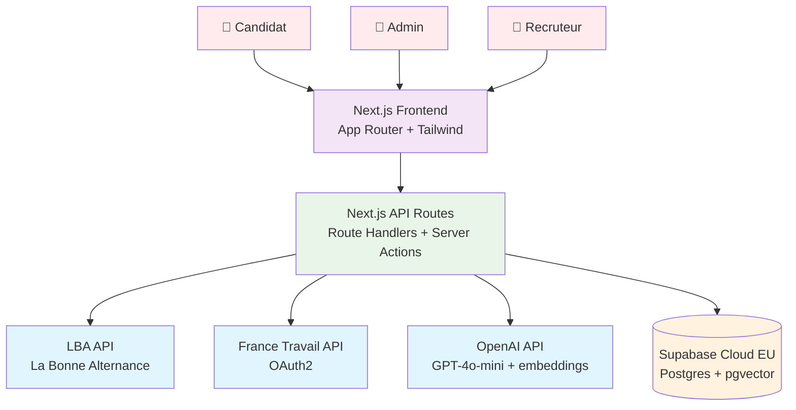
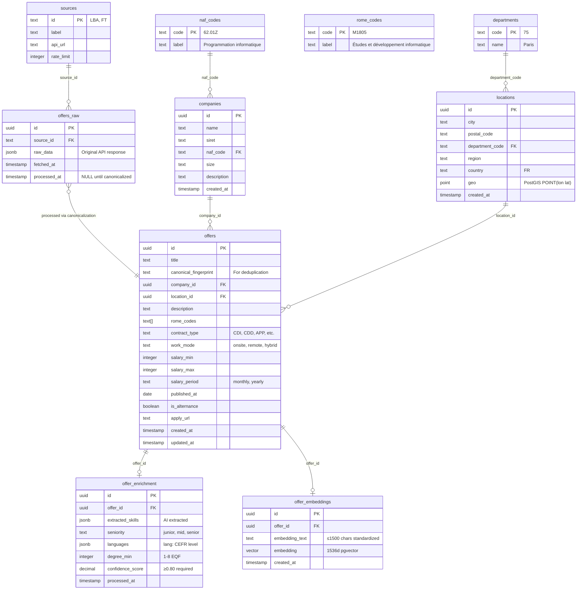
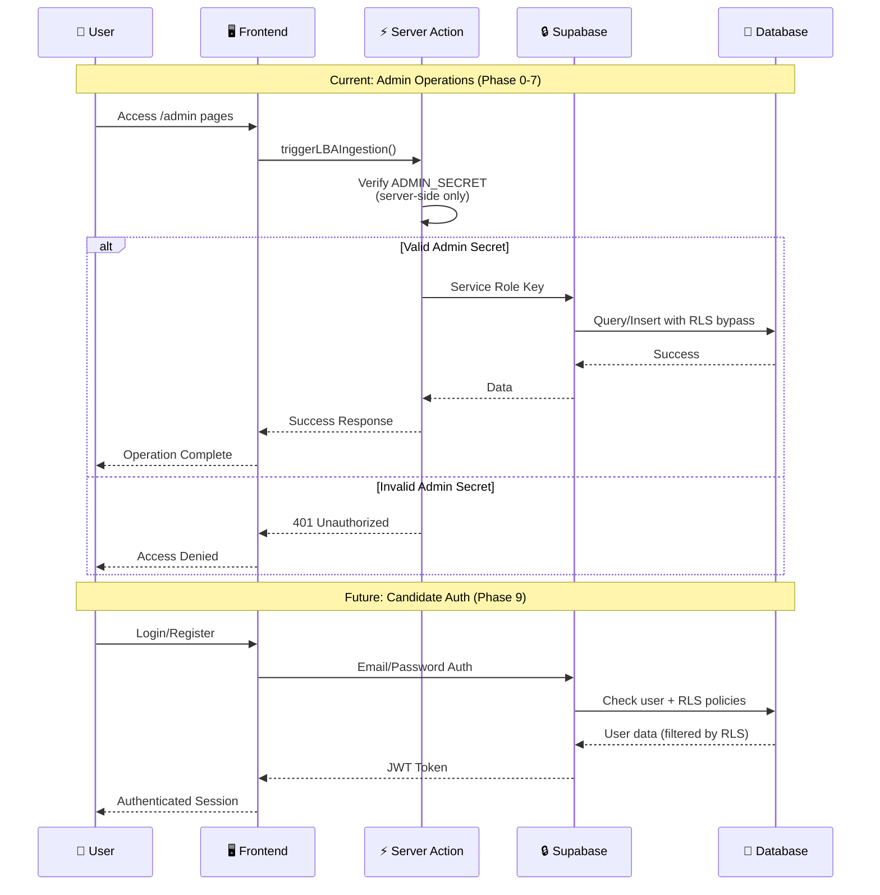
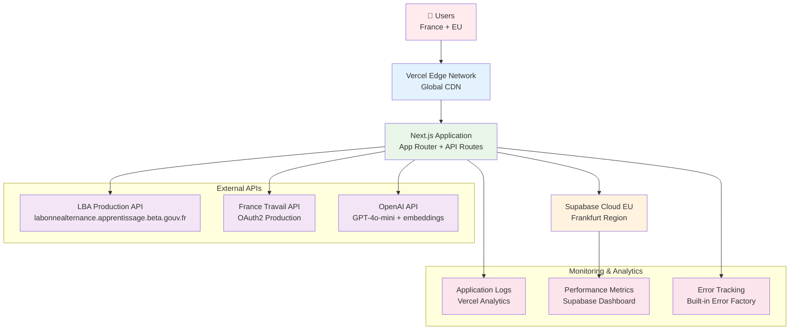
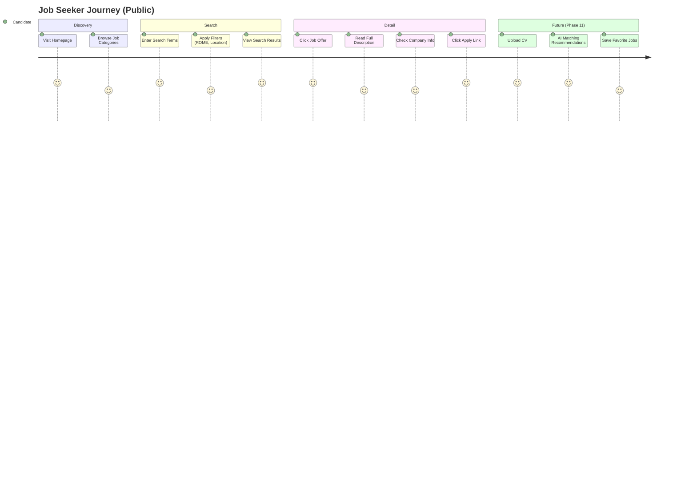
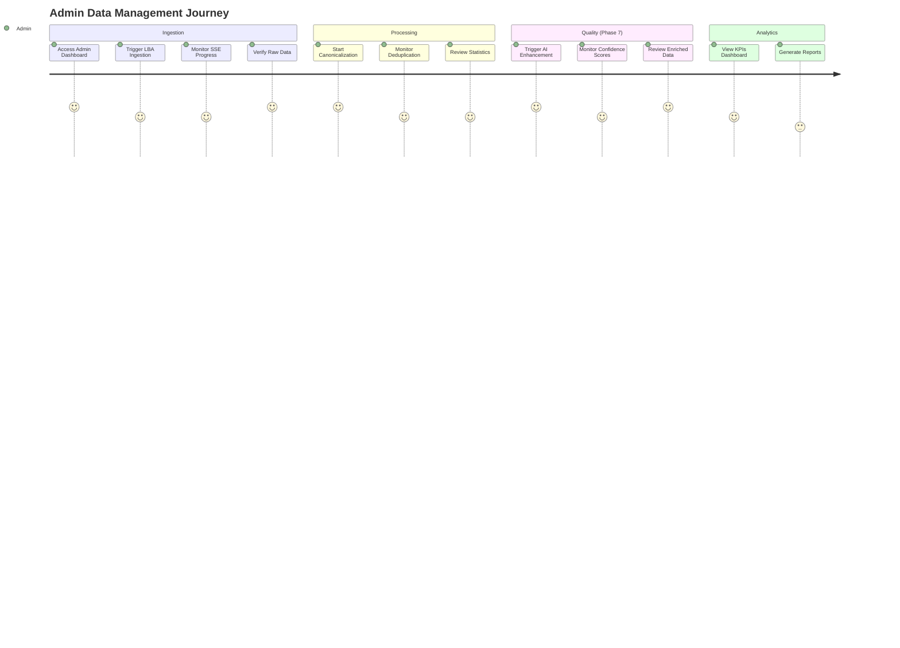
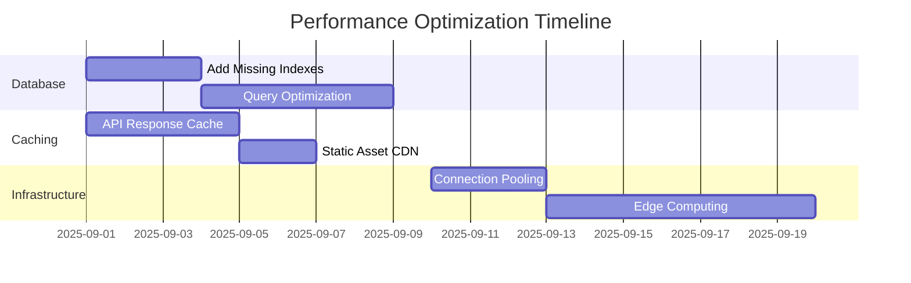

# 📊 Architecture Diagrams - cledger5
*Visual system architecture with Mermaid diagrams*

## 🏗️ **System Architecture Overview**

### **High-Level System Architecture**


## 🔄 **Data Pipeline Architecture**

### **Complete Data Flow (Phases 5-8)**

```mermaid
graph LR
    %% Raw Data Sources
    LBA_API[LBA API]
    FT_API[France Travail API]
    
    %% Phase 5: Raw Ingestion
    subgraph "Phase 5: Raw Ingestion"
        LBA_Ingest[LBA Ingestion<br/>183+ offres]
        FT_Ingest[FT Ingestion<br/>OAuth2]
        Raw_DB[(offers_raw<br/>Partitioned by month)]
    end
    
    %% Phase 6: Canonicalization  
    subgraph "Phase 6: Canonicalization"
        Dedup[Deduplication<br/>Fingerprinting]
        Canon[Canonicalization<br/>Pipeline]
        Offers_DB[(offers)]
        Companies_DB[(companies)]  
        Locations_DB[(locations)]
    end
    
    %% Phase 7: AI Enhancement (Current)
    subgraph "Phase 7: AI Enhancement"
        AI_Extract[GPT-4o-mini<br/>Skills/Seniority]
        Confidence[Confidence ≥0.80<br/>Validation]
        Enriched_DB[(offer_enrichment)]
    end
    
    %% Phase 8: Embeddings (Next)
    subgraph "Phase 8: Embeddings"
        Text_Builder[Embedding Text<br/>Builder ≤1500 chars]
        OpenAI_Embed[text-embedding-3-small<br/>1536d vectors]
        Vector_DB[(offer_embeddings<br/>HNSW index)]
    end
    
    %% Data Flow
    LBA_API --> LBA_Ingest
    FT_API --> FT_Ingest
    
    LBA_Ingest --> Raw_DB
    FT_Ingest --> Raw_DB
    
    Raw_DB --> Dedup
    Dedup --> Canon
    Canon --> Offers_DB
    Canon --> Companies_DB
    Canon --> Locations_DB
    
    Offers_DB --> AI_Extract
    AI_Extract --> Confidence
    Confidence --> Enriched_DB
    
    Enriched_DB --> Text_Builder
    Text_Builder --> OpenAI_Embed
    OpenAI_Embed --> Vector_DB
    
    %% Styling
    classDef phase5 fill:#ffcdd2
    classDef phase6 fill:#dcedc8  
    classDef phase7 fill:#fff3c4
    classDef phase8 fill:#e1f5fe
    classDef database fill:#f5f5f5
    
    class LBA_Ingest,FT_Ingest phase5
    class Dedup,Canon phase6
    class AI_Extract,Confidence phase7
    class Text_Builder,OpenAI_Embed phase8
    class Raw_DB,Offers_DB,Companies_DB,Locations_DB,Enriched_DB,Vector_DB database
```


## 🖥️ **Frontend Architecture**

### **Next.js App Router Structure**
```mermaid
graph TB
    %% Root Layout
    Root[app/layout.tsx<br/>Root Layout]
    
    %% Public Routes
    subgraph "Public Routes"
        PublicLayout[app/&#40public&#41/layout.tsx<br/>Public Layout + Nav]
        Homepage[app/page.tsx<br/>Homepage]
        Search[app/&#40public&#41/offres/page.tsx<br/>Job Search + Filters]
        Detail[app/&#40public&#41/offres/[id]/page.tsx<br/>Job Detail]
    end
    
    %% Private Routes (Admin)
    subgraph "Private Routes"
        PrivateLayout[app/&#40private&#41/layout.tsx<br/>Admin Layout + Nav]
        Dashboard[app/&#40private&#41/admin/page.tsx<br/>Admin Dashboard]
        Ingestion[app/&#40private&#41/admin/ingestion/page.tsx<br/>LBA Ingestion UI]
        Canonicalization[app/&#40private&#41/admin/canonicalization/page.tsx<br/>Data Processing]
    end
    
    %% API Routes
    subgraph "API Routes"
        SearchAPI[app/api/search/offers/route.ts]
        DetailAPI[app/api/offers/[id]/route.ts] 
        IngestAPI[app/api/ingest/lba/route.ts]
        CanonAPI[app/api/canonicalize/route.ts]
        SSE[app/api/batch/[id]/stream/route.ts]
    end
    
    %% Components
    subgraph "UI Components"
        shadcn[src/components/ui/<br/>shadcn/ui components]
        Custom[src/components/<br/>Custom components]
    end
    
    %% Flow
    Root --> PublicLayout
    Root --> PrivateLayout
    
    PublicLayout --> Homepage
    PublicLayout --> Search
    PublicLayout --> Detail
    
    PrivateLayout --> Dashboard
    PrivateLayout --> Ingestion
    PrivateLayout --> Canonicalization
    
    Search --> SearchAPI
    Detail --> DetailAPI
    Ingestion --> IngestAPI
    Canonicalization --> CanonAPI
    Dashboard --> SSE
    
    PublicLayout --> shadcn
    PrivateLayout --> shadcn
    Search --> Custom
    Detail --> Custom
    
    %% Styling
    classDef public fill:#e8f5e8
    classDef private fill:#fff3c4
    classDef api fill:#e1f5fe
    classDef components fill:#f3e5f5
    
    class PublicLayout,Homepage,Search,Detail public
    class PrivateLayout,Dashboard,Ingestion,Canonicalization private
    class SearchAPI,DetailAPI,IngestAPI,CanonAPI,SSE api
    class shadcn,Custom components
```

## 💾 **Database Architecture** 

### **Database Schema Relationships**


## 🔒 **Security Architecture**

### **Authentication & Authorization Flow**


## 🚀 **Deployment Architecture**

### **Production Environment**


## 🔄 **User Journey Flows**

### **Job Search User Journey**


### **Admin Data Management Journey**  


---

## 📈 **Performance Architecture**

### **Performance Targets vs Current**
```mermaid
xychart-beta
    title "API Response Time Targets vs Current"
    x-axis ["Search API", "Detail API", "Health Check", "SSE Stream", "Ingestion"]
    y-axis "Response Time (ms)" 0 --> 2000
    bar [500, 700, 100, 2000, 5000]
    bar [1200, 1000, 1300, 2000, "N/A"]
```

### **Optimization Roadmap**


---

*Visual architecture documentation - All system diagrams in one place*