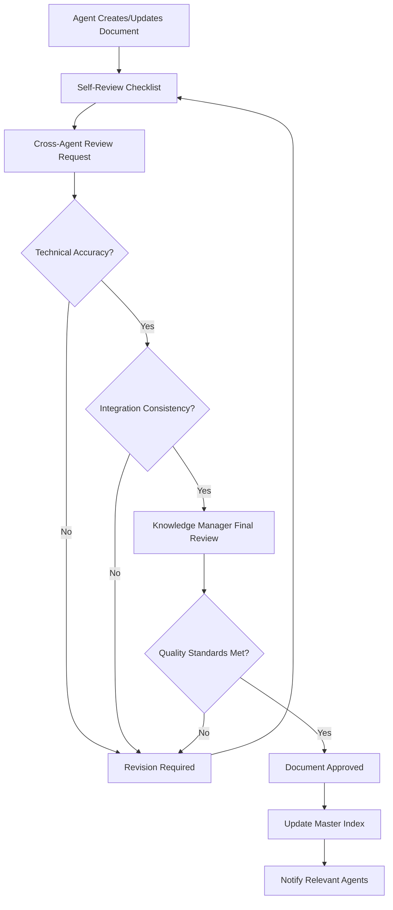

# Phase 10 - Knowledge Transfer Protocol
*Knowledge Management & Agent Coordination - Created: 01/09/2025*

## 🎯 **Protocol Overview**

The Knowledge Transfer Protocol ensures comprehensive capture, organization, and accessibility of all implementation knowledge generated during Phase 10 development by multiple specialized agents.

### **Core Objectives**
- **Complete Capture**: All design decisions, implementation details, and lessons learned documented
- **Agent Coordination**: Seamless knowledge sharing between specialized development agents
- **Institutional Memory**: Preserve critical knowledge for future development and debugging
- **Quality Assurance**: Ensure consistency and accuracy across all documentation
- **Accessibility**: Make knowledge easily discoverable and actionable

## 🏗️ **Knowledge Architecture**

### **Documentation Hierarchy**
```
docs/phase10/
├── 00-phase10-overview.md              # Central coordination document
├── 01-cv-management-specs.md           # Complete CV system specifications
├── 02-application-workflow-specs.md    # Job application system (to be created)
├── 03-saved-searches-specs.md          # Search alerts system (to be created)
├── 04-user-dashboard-specs.md          # Dashboard interface (to be created)
├── 05-security-implementation.md       # Security measures (to be created)
├── 06-testing-strategy.md              # QA framework implementation
├── qa-framework.md                     # Quality assurance standards
├── knowledge-transfer-protocol.md      # This document
├── templates/
│   ├── technical-spec-template.md      # Standard technical spec format
│   └── adr-template.md                # Architecture decision record format
├── adr/
│   ├── 001-cv-storage-strategy.md     # File storage decisions
│   ├── 002-application-status-model.md # Application lifecycle
│   └── [future ADRs]
├── implementation-log/
│   ├── daily-progress.md               # Daily development logs
│   ├── decision-rationales.md          # Major decision explanations
│   └── lessons-learned.md              # Development insights
└── agent-contributions/
    ├── frontend-agent-notes.md         # Frontend specialist contributions
    ├── backend-agent-notes.md          # Backend specialist contributions
    ├── security-agent-notes.md         # Security specialist contributions
    └── [other agent contributions]
```

### **Knowledge Categories**

#### **1. Technical Specifications**
- **Purpose**: Complete implementation guidance for all components
- **Format**: Standardized technical specification template
- **Owners**: Specialist agents (Frontend, Backend, Security, etc.)
- **Review Process**: Technical lead approval required

#### **2. Architecture Decision Records (ADRs)**
- **Purpose**: Document major technical decisions and rationale
- **Format**: Standardized ADR template with options analysis
- **Trigger**: Any decision affecting system architecture or user experience
- **Review Process**: Multi-agent review and consensus

#### **3. Implementation Logs**
- **Purpose**: Track daily progress, issues, and resolutions
- **Format**: Timestamped entries with context and outcomes
- **Frequency**: Daily updates during active development
- **Responsibility**: All agents contribute to shared logs

#### **4. Agent Contributions**
- **Purpose**: Capture specialized knowledge from different domains
- **Format**: Agent-specific documentation with cross-references
- **Integration**: Regular synthesis into main specifications
- **Ownership**: Individual specialist agents

## 🤖 **Agent Coordination Framework**

### **Agent Roles & Responsibilities**

#### **Knowledge Manager (Current Role)**
- **Primary Responsibility**: Overall documentation coordination and quality
- **Tasks**:
  - Maintain documentation structure and standards
  - Synthesize cross-agent knowledge into coherent specifications
  - Ensure consistency across all documentation
  - Coordinate documentation reviews and updates
  - Preserve institutional memory

#### **Frontend Development Agent**
- **Primary Responsibility**: UI/UX implementation and user interface documentation
- **Knowledge Contributions**:
  - React component specifications and patterns
  - User experience flows and interaction design
  - Styling and responsive design decisions
  - Accessibility implementation details
  - Performance optimization techniques

#### **Backend Development Agent**  
- **Primary Responsibility**: API development and server-side logic documentation
- **Knowledge Contributions**:
  - API endpoint specifications and schemas
  - Database design and migration strategies
  - Business logic implementation patterns
  - Performance optimization and caching
  - Integration with existing systems

#### **Security Specialist Agent**
- **Primary Responsibility**: Security implementation and compliance documentation  
- **Knowledge Contributions**:
  - PII encryption and data protection measures
  - Authentication and authorization patterns
  - GDPR compliance implementation
  - Security testing procedures and results
  - Vulnerability assessments and mitigations

#### **AI Integration Agent**
- **Primary Responsibility**: AI/ML features and prompt engineering documentation
- **Knowledge Contributions**:
  - GPT-4o-mini integration patterns and prompts
  - Embedding generation and optimization
  - AI model performance and cost analysis
  - Confidence scoring and quality thresholds
  - Error handling for AI operations

### **Communication Protocols**

#### **Daily Synchronization**
```markdown
## Daily Knowledge Sync Template

**Date**: YYYY-MM-DD
**Reporting Agent**: [Agent Name]
**Work Completed**:
- Task 1: Status and key decisions
- Task 2: Implementation approach and rationale
- Task 3: Issues encountered and resolutions

**Knowledge Generated**:
- Documentation updated: [list of files]
- Decisions made: [major choices with rationale]
- Patterns established: [reusable implementation patterns]

**Integration Points**:
- Dependencies on other agents: [list and status]
- Knowledge sharing needed: [what other agents should know]
- Review requests: [documents needing cross-agent review]

**Blockers & Questions**:
- Technical blockers: [description and assistance needed]
- Architecture questions: [decisions requiring multi-agent input]
- Clarifications needed: [areas needing more specification]
```

#### **Weekly Knowledge Review**
- **Frequency**: Every Friday
- **Participants**: All active agents + Knowledge Manager
- **Agenda**:
  1. Documentation consistency review
  2. Cross-agent integration points validation
  3. Architecture decision records discussion
  4. Upcoming week coordination
  5. Lessons learned synthesis

## 📋 **Knowledge Capture Standards**

### **Documentation Requirements**
All knowledge contributions must include:

#### **1. Context & Rationale**
- **Why**: Business or technical justification for decisions
- **Alternatives**: Other options considered and why rejected
- **Constraints**: Limitations that influenced the decision
- **Impact**: Expected effects on system and users

#### **2. Implementation Details**
- **Code Examples**: Representative implementation snippets
- **Configuration**: Required settings and environment variables  
- **Dependencies**: External libraries, services, or systems
- **Migration**: Database changes and deployment steps

#### **3. Quality Assurance**
- **Testing**: Unit, integration, and E2E test requirements
- **Validation**: Success criteria and acceptance tests
- **Monitoring**: Metrics and alerting for operational health
- **Rollback**: Procedures for reverting changes if needed

#### **4. Future Considerations**
- **Scalability**: How the solution handles growth
- **Maintenance**: Ongoing operational requirements
- **Evolution**: How the solution can be extended or modified
- **Technical Debt**: Known limitations and future improvement plans

### **Documentation Quality Standards**

#### **Accuracy Requirements**
- **Code Examples**: Must be executable and current
- **Schema Definitions**: Must match actual database structure
- **API Specifications**: Must align with implemented endpoints
- **Configuration**: Must work in stated environments

#### **Clarity Standards**
- **Audience**: Written for future developers and maintainers
- **Language**: Clear, concise, and jargon-free
- **Structure**: Logical organization with clear headings
- **Examples**: Concrete examples for abstract concepts

#### **Completeness Criteria**
- **Prerequisites**: All dependencies and setup requirements documented
- **Step-by-Step**: Complete procedures for implementation
- **Edge Cases**: Error conditions and exception handling
- **Integration**: How components work together

## 🔄 **Knowledge Validation Process**

### **Review Workflow**


### **Review Checklists**

#### **Technical Review Checklist**
- [ ] Code examples are syntactically correct and executable
- [ ] Database schemas match current structure
- [ ] API specifications align with implemented endpoints
- [ ] Security measures are properly documented
- [ ] Performance implications are considered
- [ ] Error handling is comprehensive

#### **Integration Review Checklist**  
- [ ] Dependencies on other components are clearly identified
- [ ] Integration points are well-defined
- [ ] Data flow between systems is documented
- [ ] Backwards compatibility is maintained
- [ ] Migration path from current state is clear

#### **Quality Review Checklist**
- [ ] Document follows established templates
- [ ] All required sections are complete
- [ ] Writing is clear and accessible
- [ ] Examples support the explanations
- [ ] Future considerations are addressed
- [ ] Links and references are valid

## 📊 **Knowledge Metrics & Health**

### **Documentation Health Indicators**
- **Coverage**: Percentage of implemented features with complete documentation
- **Freshness**: Time since last update for each document
- **Consistency**: Cross-reference accuracy between related documents
- **Usability**: Feedback from developers using the documentation

### **Knowledge Quality Metrics**
- **Accuracy Rate**: Percentage of documented procedures that work as described
- **Completeness Score**: Average completeness rating across all documents
- **Review Velocity**: Time from creation to approval for new documents
- **Update Frequency**: How often documents are maintained and improved

### **Agent Contribution Tracking**
- **Contribution Volume**: Number of documentation updates per agent
- **Knowledge Areas**: Domains covered by each agent
- **Cross-Agent Collaboration**: Frequency of multi-agent document reviews
- **Expertise Mapping**: Which agents are authorities on specific topics

## 🔧 **Tools & Infrastructure**

### **Documentation Tools**
- **Primary Format**: Markdown for all documentation
- **Version Control**: Git with clear commit messages
- **Review Process**: GitHub pull requests with required approvals
- **Search**: Full-text search across all documentation
- **Cross-References**: Automated link validation

### **Knowledge Management Tools**
- **Index Generation**: Automated table of contents and cross-references
- **Document Templates**: Standardized formats for consistency
- **Review Tracking**: Status of all documents in review process
- **Change Notifications**: Alerts when relevant documents are updated

### **Integration Tools**
- **Code Synchronization**: Documentation updates with code changes
- **Schema Validation**: Automatic checking of database documentation
- **API Documentation**: Generated from OpenAPI specifications
- **Test Integration**: Documentation examples as executable tests

## 📅 **Implementation Timeline**

### **Week 1-2: Foundation**
- Complete documentation structure setup
- Finalize all templates and standards
- Establish agent communication protocols  
- Create initial technical specifications

### **Week 3-4: Active Development**
- Daily knowledge capture as development proceeds
- Regular cross-agent reviews and integration
- Architecture decision records for major choices
- Continuous documentation updates

### **Week 5-6: Integration & Validation**
- Comprehensive documentation review
- Knowledge gap identification and filling
- Final quality assurance validation
- Handoff documentation preparation

## 🔗 **Success Criteria**

### **Documentation Completeness**
- [ ] 100% of implemented features have complete technical specifications
- [ ] All major architecture decisions are documented with rationale
- [ ] Integration points between components are clearly defined
- [ ] Security implementation is fully documented with compliance evidence
- [ ] Testing procedures and quality gates are specified

### **Knowledge Accessibility**
- [ ] Any developer can find relevant information within 2 minutes
- [ ] Documentation is current and reflects actual implementation
- [ ] Cross-references between related topics are complete and accurate
- [ ] Search functionality returns relevant results
- [ ] Mobile and accessibility considerations are documented

### **Agent Coordination**
- [ ] All specialized agents have contributed domain expertise
- [ ] Cross-agent knowledge integration is seamless
- [ ] Conflicting information has been identified and resolved
- [ ] Knowledge gaps have been identified and filled
- [ ] Future development guidance is clear and actionable

---

*This Knowledge Transfer Protocol ensures that all implementation knowledge from Phase 10 is systematically captured, organized, and made accessible for future development, debugging, and team onboarding.*